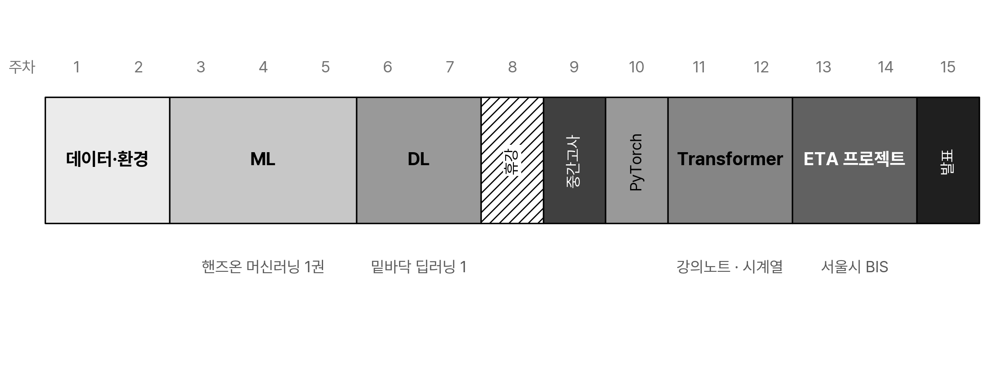

<!-- 덱 설계
청중: 스마트시티학과 2학년. Python 숙련도 혼재, ML·DL 처음. 첫 수업이라 과목 선택(수강 정정 기간)을 돕는 정보도 필요
시간: 화 이론 110분 중 강의 약 70분 (뒤는 질의·수강 상담) → 본문 19장
메시지: ML·DL 기초부터 교통 문제 적용까지
목표: 과목 범위, 15주 로드맵, 교재·평가·실습 안내
출처: syllabus.md · schedule.md · CURRICULUM.md
-->

# 교과목 개요

## 수업 내용
모빌리티 및 스마트시티 분야에서 활용되는 AI·ML의 기본 개념을 익히고,
실제 데이터를 활용한 분석과 모델 학습을 수행

## 이 과목의 세 단계
- 3~5주: scikit-learn으로 기계학습 모델 사용
  - 『핸즈온 머신러닝 3판』 Ch1·2·3(발췌)·4·6·7
- 6~12주: 신경망 기초, PyTorch, Attention·Transformer
  - 『밑바닥부터 시작하는 딥러닝 1』 Ch2~6 + 강의노트
- 13~14주: 서울시 BIS 기반 노선별 버스 ETA
> 정형 데이터 모델 → 신경망 → Transformer → ETA 적용

## 모빌리티 트랙에서의 위치
- 2학년: ML·DL 기초와 교통 응용
- 3학년: 알고리즘과 시뮬레이션

표: 모빌리티 트랙 과목의 역할
| 과목 | 성격 | 마무리 |
|---|---|---|
| AI 모빌리티 · 2학년 | ML·DL 기초와 교통 응용 | 팀 프로젝트 |
| 스마트 교통물류 · 3학년 | 알고리즘·시뮬레이션 | 개인 프로젝트 |
> AI 모빌리티에서 다룬 ML·DL 기초를 스마트 교통물류의 예측·시뮬레이션 문제와 연결

## 다루지 않는 것
- 최적화·라우팅·배차, 시뮬레이션 구축: 「스마트 교통물류」
- 객체탐지·자율주행 인지
> 정형·시계열 데이터 기반 예측 문제에 집중

# AI 모빌리티 적용 분야

## 주요 예측 문제
표: 모빌리티 데이터와 예측 문제
| 데이터 | 예측 문제 | 활용 예시 |
|---|---|---|
| 버스 운행 이력 | 도착시간·구간 통행시간 | BIS·도착정보 안내 |
| 대중교통 이용 이력 | 시간대·지역별 수요 | 배차계획 |
| 링크 속도·GPS 궤적 | 통행시간 | 경로 안내 |
| 공유모빌리티 이용 이력 | 대여·반납 수요 | 차량 재배치 |

## 수업 적용 주제
- 서울시 BIS 데이터
- 선정된 버스 노선별 모델 학습
- 정형 특성과 최근 구간 통행시간 시퀀스 활용
- XGBoost·MLP·Transformer 비교
- 날짜 기준 검증과 구간별 오차 분석

# 15주 로드맵

## 15주 전체 구성

> 1~2주 데이터·환경 → 3~5주 ML → 6~7주 DL → 8주 휴강 → 9주 중간고사·팀 편성 → 10주 PyTorch → 11~12주 Transformer → 13~14주 ETA 프로젝트 → 15주 발표

## ML 파트 (3~5주)
- Ch1·2·3(발췌)·4·6·7
- Ch2: End-to-End 프로젝트 흐름
- 4주차: 경사하강법·비용함수·규제
- 5주차: Random Forest·XGBoost
> 교재 예제를 따라간 뒤 과제에서는 교통 데이터에 적용

## DL 파트 (6~7·10주)
- numpy 기반 신경망 구현
  - 순전파(6주) → 손실함수·경사법(7주) → 오차역전파(7주)
- 계산 그래프를 이용한 역전파
- 10주차 PyTorch·MLP·옵티마이저
> 라이브러리 사용에 앞서 순전파와 역전파의 계산 과정 확인

## Transformer·ETA 파트 (11~14주)
- 11주차: 시계열 입력과 Self-Attention
- 12주차: Transformer Encoder 기반 회귀
- 13주차: 노선별 BIS 데이터와 ETA 모델
- 14주차: 모델 비교와 오차 분석
> XGBoost·MLP·Transformer를 동일한 날짜 기준 분할로 비교

## 교재 — 두 권 필수
- 『핸즈온 머신러닝 3판』 — ML · 3~5주
- 『밑바닥부터 시작하는 딥러닝 1』 — DL · 6~7·10주
- Attention·Transformer — 강의노트
- 실습 코드: GitHub 공개

> 두 권 모두 주교재. 다음 주부터 『핸즈온 머신러닝 3판』 사용

# 평가와 운영

## 평가 비중
표: 평가 항목과 비중
| 항목 | 비중 | 비고 |
|---|---|---|
| 중간고사 | 30% | 10-27 시행 |
| 팀 프로젝트 | 35% | 발표 25 · 보고서 10 |
| 실습 과제 | 25% | HW1~HW4 |
| 출석·참여 | 10% | 학칙 적용 |
> 기말고사 대신 팀 프로젝트 발표·보고서로 평가

## 중간고사와 팀 프로젝트
- 중간고사(9주차)
  - 개념 단답: closed-book
  - 코드 해석·수정: open-book
- 팀 프로젝트: 8개 팀, 팀당 4~5인
  - 서울시 BIS 기반 노선별 버스 ETA
- 대상: 최대 4개 노선, 노선당 2개 팀
- 최종 발표: 15주차(12-08), 팀당 발표 8분·질의응답 4분
> 9주차 대상 노선 공지, 13~14주차 프로젝트 실습

## 실습 과제 4회
- 제출: repository의 `assignments/` 안내
- 지각 제출: 하루당 10% 감점
- HW3: 8주차 휴강 대체 과제

표: 과제 4회의 내용과 기한
| 과제 | 내용 | 배포 → 마감 |
|---|---|---|
| HW1 | 데이터 정제·시각화 | 2 → 4주 |
| HW2 | End-to-End 재현 | 3 → 5주 |
| HW3 | 앙상블 비교 리포트 | 8 → 10주 |
| HW4 | 역전파·옵티마이저 | 10 → 12주 |
> HW2에서는 핸즈온 Ch2의 작업 흐름을 교통 데이터로 재현

## 과제 작성 원칙
- 외부 자료와 코드의 출처 명시
- 실행 가능한 분석 코드 제출
- 데이터 처리와 모델 선택 근거 설명
- 제출한 코드와 결과에 대한 질의응답

## 출결·휴강·연락
- 8주차(10/20–21): 휴강, HW3 대체
- 출결: 학칙 적용, 결석 초과 시 F
- 강의 자료·과제: GitHub repository
- 오피스 아워: 수 17:00–20:00
- 연락: jihoyeo@gachon.ac.kr
> 수강 정정 기간: 9/1~9/7

# 실습 환경과 다음 주

## 실습 도구
- 기본: Python·pandas·scikit-learn
- 공간 데이터: GeoPandas
- 신경망 구현: numpy
- 10주차 이후: PyTorch
- 설치가 어려운 경우: Google Colab
> 수요일 실습 시간에 Python 환경 점검

## 환경 점검 미리보기
- 확인 항목: numpy·pandas·scikit-learn import
- 로컬 환경이 어려운 경우 Google Colab 사용

```python
import numpy as np
import pandas as pd
import sklearn

print(np.__version__)
print(pd.__version__)
print(sklearn.__version__)

df = pd.DataFrame({
    "mode": ["bus", "subway", "taxi"],
    "trips": [420, 310, 88],
})
print(df["trips"].mean())  # (결과) 272.67
```
> 패키지 버전보다 import 성공 여부 확인

## 이번 주 할 일
- 주교재 두 권 준비
  - 밑바닥 Ch1(헬로 파이썬)은 2주차 자습 과제
- 수요일 실습: 12:00, AI공학관 210호
  - Python 환경 설정
- 다음 주: 모빌리티 데이터의 이해
  - GPS 궤적·교통카드·OD·링크 속도
> 다음 주 HW1(데이터 정제·시각화) 배포
