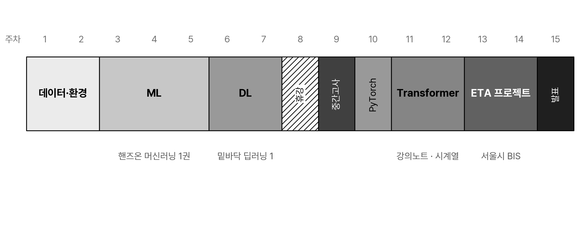

<!-- 덱 설계
청중: 스마트시티학과 2학년. Python 숙련도 혼재, ML·DL 처음. 첫 수업이라 과목 선택(수강 정정 기간)을 돕는 정보도 필요
시간: 화 이론 110분 중 강의 약 70분 (뒤는 질의·수강 상담) → 본문 20장
메시지: ML·DL 기초부터 교통 문제 적용까지
목표: 과목 범위, 15주 로드맵, 교재·평가·실습 안내
출처: syllabus.md · schedule.md · CURRICULUM.md
-->

# 교과목 개요

## 수업 내용

모빌리티 및 스마트시티 분야에서 활용되는 AI·ML의 기본 개념을 익히고,
실제 데이터를 활용한 분석과 모델 학습을 수행

## 이 과목의 세 단계

- 3~5주: scikit-learn으로 기계학습 모델 사용
  - 『핸즈온 머신러닝 3판』 Ch1·2·3(발췌)·4·6·7
- 6~12주: 신경망 기초, PyTorch, Attention·Transformer
  - 『밑바닥부터 시작하는 딥러닝 1』 Ch2~6 + 강의노트
- 13~14주: 서울시 BIS 기반 노선별 버스 ETA
  > 정형 데이터 모델 → 신경망 → Transformer → ETA 적용


## 교통 & 모빌리티 트랙에서의 위치

- 2학년: ML·DL 기초와 교통 응용
- 3학년: 알고리즘과 시뮬레이션

표: 모빌리티 트랙 과목의 역할


| 과목             | 성격              | 마무리     |
| -------------- | --------------- | ------- |
| AI 모빌리티 · 2학년  | ML·DL 기초와 교통 응용 | 팀 프로젝트  |
| 스마트 교통물류 · 3학년 | 알고리즘·시뮬레이션      | 개인 프로젝트 |


> AI 모빌리티에서 다룬 ML·DL 기초를 스마트 교통물류의 예측·시뮬레이션 문제와 연결


# AI 모빌리티 적용 분야


## 주요 예측 문제

표: 모빌리티 데이터와 예측 문제


| 데이터          | 예측 문제        | 활용 예시       |
| ------------ | ------------ | ----------- |
| 버스 운행 이력     | 도착시간·구간 통행시간 | BIS·도착정보 안내 |
| 대중교통 이용 이력   | 시간대·지역별 수요   | 배차계획        |
| 링크 속도·GPS 궤적 | 통행시간         | 경로 안내       |
| 공유모빌리티 이용 이력 | 대여·반납 수요     | 차량 재배치      |


## 수업 적용 주제

- 서울시 BIS 데이터 & 스마트카드 데이터
- 선정된 버스 노선별 모델 학습
- 정형 특성과 최근 구간 통행시간 시퀀스 활용
- XGBoost·MLP·Transformer 비교
- 날짜 기준 검증과 구간별 오차 분석


# 15주 로드맵


## 15주 전체 구성



> 1~2주 데이터·환경 → 3~5주 ML → 6~7주 DL → 8주 휴강 → 9주 중간고사·팀 편성 → 10주 PyTorch → 11~12주 Transformer → 13~14주 ETA 프로젝트 → 15주 발표


## ML 파트 (3~5주)

- Ch1·2·3(발췌)·4·6·7
- Ch2: End-to-End 프로젝트 흐름
- 4주차: 경사하강법·비용함수·규제
- 5주차: Random Forest·XGBoost
  > 교재 예제를 따라간 뒤 과제에서는 교통 데이터에 적용


## DL 파트 (6~7·10주)

- numpy 기반 신경망 구현
  - 순전파(6주) → 손실함수·경사법(7주) → 오차역전파(7주)
- 계산 그래프를 이용한 역전파
- 10주차 PyTorch·MLP·옵티마이저
  > 라이브러리 사용에 앞서 순전파와 역전파의 계산 과정 확인


## Transformer·ETA 파트

- 11주차: 시계열 입력과 Self-Attention
- 12주차: Transformer Encoder 기반 회귀
- 13주차: 노선별 BIS 데이터와 ETA 모델
- 14주차: 모델 비교와 오차 분석
  > XGBoost·MLP·Transformer를 동일한 날짜 기준 분할로 비교


## 교재 — 두 권 필수

- 『핸즈온 머신러닝 3판』 — ML · 3~5주
- 『밑바닥부터 시작하는 딥러닝 1』 — DL · 6~7·10주
- Attention·Transformer — 강의노트
- 실습 코드: GitHub 공개

> 두 권 모두 주교재. 다음 주부터 『핸즈온 머신러닝 3판』 사용


# 평가와 운영


## 평가 비중

표: 평가 항목과 비중


| 항목     | 비중  | 비고             |
| ------ | --- | -------------- |
| 중간고사   | 30% | 10-27 시행       |
| 팀 프로젝트 | 35% | 발표 25 · 보고서 10 |
| 실습 과제  | 25% | HW1~HW3        |
| 출석·참여  | 10% | 학칙 적용          |


> 기말고사 대신 팀 프로젝트 발표·보고서로 평가


## 중간고사와 팀 프로젝트

- 중간고사(9주차)
  - 개념 단답: closed-book
  - 코드 해석·수정: open-book
- 팀 프로젝트: 8개 팀, 팀당 4~5인
  - 서울시 BIS 기반 노선별 버스 ETA
- 대상: 최대 4개 노선, 노선당 2개 팀
- 최종 발표: 15주차(12-08), 팀당 발표 8분·질의응답 4분
  > 9주차 대상 노선 공지, 13~14주차 프로젝트 실습


## 실습 과제 3회

- 제출: repository의 assignments 폴더 안내
- 지각 제출: 하루당 10% 감점
- 2~4주차는 과제 없음 — 이론과 실습에 집중
- HW2: 8주차 휴강 대체 과제

표: 과제 3회의 내용과 기한


| 과제  | 내용                | 배포 → 마감  |
| --- | ----------------- | -------- |
| HW1 | 제주 데이터 End-to-End | 5 → 7주   |
| HW2 | 앙상블 비교 리포트        | 8 → 11주  |
| HW3 | 역전파·옵티마이저         | 11 → 13주 |


> 과제는 해당 내용을 다루는 이론이 끝난 뒤에 배포한다


## 과제 작성 원칙

- 외부 자료와 코드의 출처 명시
- 실행 가능한 분석 코드 제출
- AI 코딩 도구는 제한 없이 사용
  - 정확성의 책임은 제출한 학생에게
- 제출물은 노트북 + 검토표 한 장
  - 결과의 주요 숫자를 옮겨 적고 기준선과 비교
- 마감 다음 주 실습에서 전원 숫자를 익명 비교
  - 이상을 찾으면 한 주 안에 감점 없이 재제출
    > 잘 맞히는 것보다 자기 결과를 한 번 들여다보는 쪽에 점수를 준다


## 출결·휴강·연락

- 8주차(10/20–21): 휴강, HW2 대체
- 출결: 학칙 적용, 결석 초과 시 F
- 강의 자료·과제: GitHub repository
- 오피스 아워: 수 17:00–20:00
- 연락: jihoyeo@gachon.ac.kr
  > 수강 정정 기간: 9/1~9/7


# 실습 환경과 다음 주


## 분석 도구

- 기본: Python·pandas·scikit-learn
- 공간 데이터: GeoPandas
- 신경망 구현: numpy
- 10주차 이후: PyTorch
- 설치가 어려운 경우: Google Colab
  > 수요일 실습 시간에 환경 점검


## AI 코딩 도구

- 기본 에디터: Google Antigravity
  - VS Code 기반, 에이전트 내장, 무료 플랜
- 코딩 에이전트: OpenAI Codex
  - 터미널·웹에서 사용, 2주차에 설치
- 파이썬 문법은 따로 가르치지 않음
  - 필요한 시점에 도구로 해결
    > 코드를 처음부터 쓰는 대신, 만들어진 코드를 읽고 검증하는 데 시간을 쓴다


## 환경 점검 미리보기

- 확인 항목: numpy·pandas·scikit-learn import
- 로컬 환경이 어려운 경우 Google Colab 사용

```python
import numpy as np
import pandas as pd
import sklearn

print(np.__version__)
print(pd.__version__)
print(sklearn.__version__)

df = pd.DataFrame({
    "mode": ["bus", "subway", "taxi"],
    "trips": [420, 310, 88],
})
print(df["trips"].mean())  # (결과) 272.67
```

> 패키지 버전보다 import 성공 여부 확인


## 이번 주 할 일

- 주교재 두 권 준비
- 수요일 실습: 12:00, AI공학관 210호
  - Python 환경 점검
- 다음 주: 머신러닝 개요 (핸즈온 Ch1)
  - 개발 환경·AI 코딩 도구 세팅
    > 다음 주부터 핸즈온 머신러닝. 첫 과제는 5주차 배포

