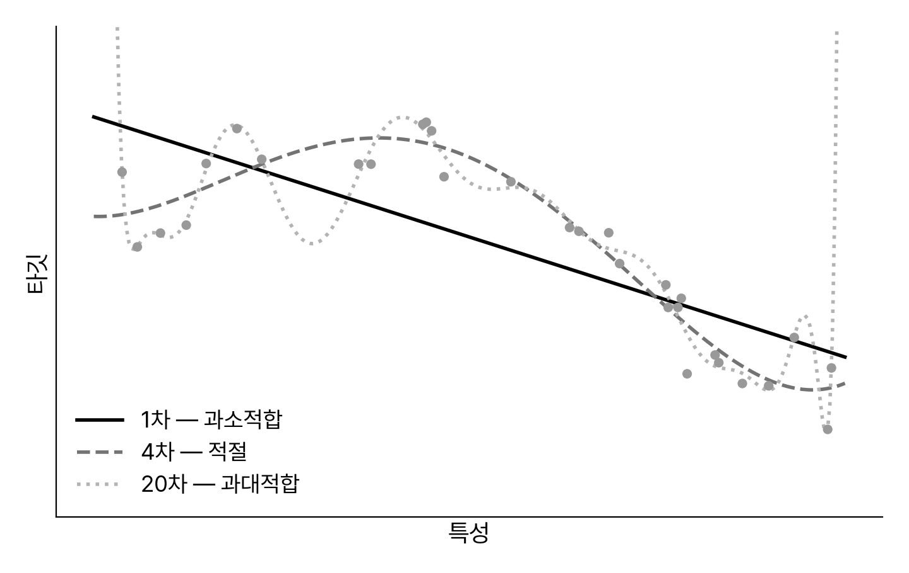
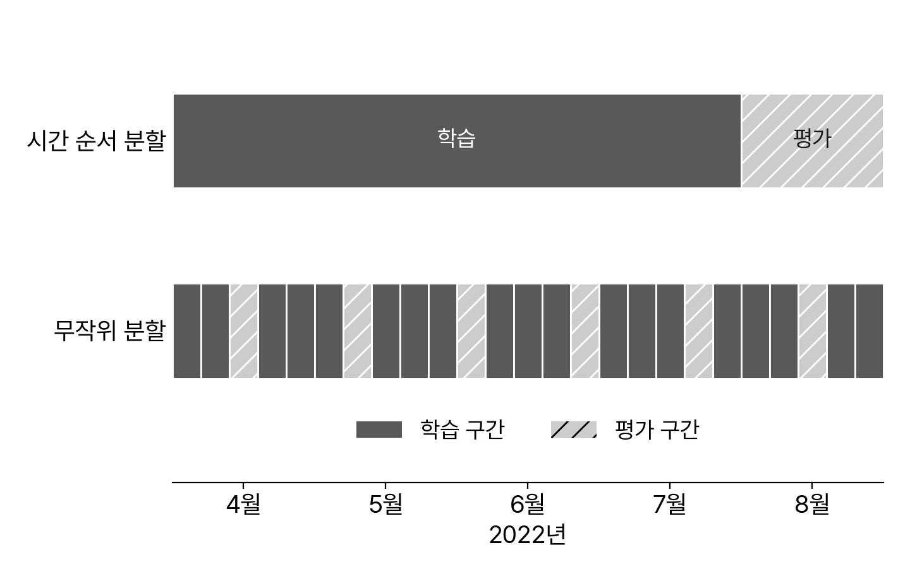

<!-- 덱 설계
청중: 스마트시티학과 2학년. 1주차 오리엔테이션만 마쳤고 ML 용어는 처음. 파이썬 숙련도 혼재
시간: 화 이론 110분 중 강의 약 70분 → 본문 19장. 개발 환경과 도구는 수요일 실습 덱(lab.md)으로 분리
메시지: 머신러닝은 규칙을 사람이 쓰는 대신 데이터에서 찾게 하는 방법이고, 잘 됐는지는 새 데이터로만 확인된다
목표: (1) 세 가지 분류 기준을 조합으로 설명한다 (2) 과대적합·과소적합과 규제를 구분한다 (3) 훈련·검증·테스트의 역할을 말한다
출처: 『핸즈온 머신러닝 3판』 1장(pp. 27~66) · 강의노트 materials/handson-ml/week02_ch01.md · 코드는 handson-ml3의 01_the_machine_learning_landscape.ipynb
구성: 섹션과 슬라이드를 교재 1장의 절·소절 순서에 맞춘다. 노트 첫머리에 해당 절 번호를 적어 교재를 펴고 따라올 수 있게 한다
용어: 교재 번역본 표기를 그대로 쓴다(새뮤얼, 훈련 세트, 훈련 사례, 타깃, 특이치 탐지, 외부 메모리 학습, 모델 부패, 개발 세트)
제목: 교재의 1.1·1.2는 의문형이지만 슬라이드 제목은 명사구로 바꾼다(서식 규칙). 원 제목은 노트에 적는다
제외: End-to-End 워크플로우(3주차), 실습 데이터 소개(5주차), 파이썬 문법(별도 강의 없음), 연습문제
보강: 시간 순서 분할은 교재 1장에 없으나 ETA 프로젝트에 필요해 4.4에 넣는다
-->

# 머신러닝의 정의와 사용 이유

## 교재 1장의 구성

표: 오늘 다루는 교재 1장의 절과 쪽
| 절 | 제목 | 쪽 |
|---|---|---|
| 1.1~1.3 | 머신러닝이란, 사용 이유, 애플리케이션 사례 | 28 |
| 1.4 | 머신러닝 시스템의 종류 | 34 |
| 1.5 | 머신러닝의 주요 도전 과제 | 54 |
| 1.6 | 테스트와 검증 | 62 |
| — | 연습문제 (수업에서 다루지 않음) | 66 |
> 교재를 펴고 따라오게 한다. 이 장은 교재에서 코드가 거의 없는 유일한 장이고, 저자는 나머지를 읽기 전에 이 장을 모두 이해할 것을 요구한다. 수요일 실습은 개발 환경 세팅으로 따로 진행한다.

## 머신러닝의 정의
- **새뮤얼(1959)** — 명시적인 프로그래밍 없이 학습하는 능력을 갖추게 하는 연구 분야
- **미첼(1997)** — 작업 T, 성능 측정 P, 경험 E
  - 경험 E로 작업 T의 성능 P가 향상되면 학습
- 스팸 필터 — T 스팸 구분, E 훈련 데이터, P 정확도
- 데이터를 모으는 것은 학습이 아님 — 위키백과 내려받기
> 교재 1.1(p.28). 용어 세 가지를 여기서 정한다. 훈련 세트, 훈련 사례(샘플), 모델. 학생에게 버스 도착시간 예측을 T·P·E에 대입해 보게 한다.

## 머신러닝을 사용하는 이유
- 규칙을 사람이 작성
- 조건이 늘수록 유지 부담
- 규칙을 데이터에서 학습
- 자동으로 변화에 적응
- 데이터 마이닝으로 이해

표: 스팸 필터의 두 접근법 (교재 그림 1-1·1-2)
| 항목 | 전통적 접근법 | 머신러닝 접근법 |
|---|---|---|
| 규칙 | 사람이 작성 | 알고리즘이 학습 |
| 변경 | 규칙 수정 후 재배포 | 새 데이터로 재훈련 |
| 결과 | 규칙이 길고 복잡 | 프로그램이 짧아짐 |
> 교재 1.2(p.29). 발송자가 `4U` 대신 `For U`를 쓰면 전통적 필터는 사람이 규칙을 고쳐야 하지만 머신러닝 필터는 스스로 인식한다. 뛰어난 분야 네 가지를 짚는다. 수동 조정이 많은 문제, 전통적 방식으로 풀 수 없는 문제, 유동적인 환경, 대량 데이터에서 인사이트 얻기.

## 애플리케이션 사례

표: 교재의 작업 유형과 모빌리티 대응
| 교재 사례 | 작업 유형 | 모빌리티 대응 |
|---|---|---|
| 생산 라인 제품 이미지 분류 | 이미지 분류 | 도로 시설물 판별 |
| 내년도 수익 예측 | 회귀 | 통행시간·ETA 예측 |
| 고객 세분화 | 군집 | 통행 패턴 그룹화 |
| 신용카드 부정 거래 감지 | 이상치 탐지 | 이상 운행 감지 |
| 지능형 게임 봇 | 강화 학습 | 신호 제어 |
> 교재 1.3(p.32). 통행시간·통행속도·ETA는 모두 회귀에 속한다. 교재의 회귀 행이 선형 회귀에서 랜덤 포레스트, 신경망, 트랜스포머로 이어지는데 이 수업이 그 순서를 그대로 따라간다.

# 머신러닝 시스템의 종류

## 세 가지 분류 기준
- **훈련 지도 방식** — 지도, 비지도, 준지도, 자기 지도, 강화
- **점진적 학습 여부** — 배치 학습과 온라인 학습
- **일반화 방식** — 사례 기반과 모델 기반
- 세 기준은 배타적이지 않고 원하는 대로 연결
> 교재 1.4(p.34) 도입부. 학생들이 트리 구조로 오해하기 쉬운 지점이다. 교재의 예는 심층 신경망으로 실시간 학습하는 스팸 필터로 온라인·모델 기반·지도 학습이다. ETA 모델은 배치·모델 기반·지도 학습이라고 대응시킨다.

## 지도 학습과 비지도 학습
- **지도 학습** — 훈련 데이터에 레이블 포함
  - 분류(스팸 필터), 회귀(중고차 가격)
  - 특성은 예측 변수·속성으로도 부름
- **비지도 학습** — 레이블 없이 학습
  - 군집, 시각화, 차원 축소
  - 이상치 탐지, 특이치 탐지, 연관 규칙 학습
> 교재 1.4.1 앞부분. 타깃은 회귀에서, 레이블은 분류에서 주로 쓴다. 로지스틱 회귀는 클래스에 속할 확률을 출력하는 분류 모델이다. 상관관계 있는 특성을 합치는 것이 특성 추출이다.

## 준지도·자기 지도·강화 학습
- **준지도 학습** — 레이블이 일부에만 있음
  - 구글 포토의 인물 묶기
- **자기 지도 학습** — 레이블을 데이터에서 생성
  - 가린 이미지를 복원하도록 훈련
  - 미세 튜닝과 전이 학습으로 연결
- **강화 학습** — 에이전트가 보상으로 정책 학습
> 교재 1.4.1 뒷부분. 준지도는 대부분 지도와 비지도의 조합이다. 자기 지도는 훈련 중 생성된 레이블을 쓰고 목표가 분류·회귀라서 교재가 별개 범주로 둔다. 알파고는 대국 때 학습을 끄고 적용만 했다.

## 배치 학습과 온라인 학습
- 배치: 가용 데이터 전체로
- 오프라인 학습이라고도 함
- 온라인: 미니배치로 점진
- 학습률 높으면 빨리 잊음
- 모델 부패와 데이터 드리프트

표: 두 학습 방식의 비교
| 항목 | 배치 학습 | 온라인 학습 |
|---|---|---|
| 훈련 | 전체를 한 번에 | 미니배치 순차 |
| 갱신 | 재훈련 후 배포 | 도착하는 대로 |
| 자원 | 시간·계산량 큼 | 적은 메모리 |
> 교재 1.4.2. 외부 메모리 학습은 보통 오프라인으로 실행하므로 점진적 학습으로 생각하는 편이 낫다. 온라인 시스템은 나쁜 데이터가 들어오면 성능이 빠르게 떨어져 감시가 필요하다. 이 수업은 재현 가능한 비교를 위해 배치 학습을 쓴다.

## 사례 기반 학습과 모델 기반 학습
- 사례 기반: 샘플을 기억
- 유사도를 측정해 일반화
- 모델 기반: 모델을 만들어 예측
- 비용 함수를 최소화
- 교재 예: 삶의 만족도

```python
import pandas as pd
from sklearn.linear_model import LinearRegression
from sklearn.neighbors import KNeighborsRegressor

lifesat = pd.read_csv("lifesat.csv")
X = lifesat[["GDP per capita (USD)"]].values
y = lifesat[["Life satisfaction"]].values

model = LinearRegression()           # 모델 기반
model.fit(X, y)
print(model.predict([[37_655.2]]))   # (결과) [[6.30]]

model = KNeighborsRegressor(n_neighbors=3)   # 사례 기반
model.fit(X, y)
print(model.predict([[37_655.2]]))   # (결과) [[6.33]]
```
> 교재 1.4.3. OECD 더 나은 삶의 지표와 세계 은행의 1인당 GDP를 합친 예제다. 클래스 이름만 바꾸면 두 방식을 교체할 수 있다. 프로젝트의 형태는 데이터 분석, 모델 선택, 훈련, 예측 순이고 마지막 단계를 추론이라 부른다.

# 머신러닝의 주요 도전 과제

## 나쁜 데이터 — 양과 대표성
- 문제가 될 수 있는 것은 나쁜 데이터와 나쁜 모델
- **충분하지 않은 양** — 간단한 문제도 수천 개
- **대표성 없는 훈련 데이터**
  - 샘플링 잡음 — 샘플이 작아 생기는 우연
  - 샘플링 편향 — 추출 방법이 잘못된 경우
> 교재 1.5.1~1.5.2(p.54). 데이터가 많으면 알고리즘 차이가 줄어든다는 결과가 있지만 교재는 곧바로 단서를 단다. 중소 규모 데이터셋이 흔하다. 1936년 미국 대선 여론조사는 부유층 편중과 비응답 편향이 겹친 사례다. 방학이나 특정 시간대만 뽑아 훈련하면 같은 편향이 생긴다.

## 나쁜 데이터 — 품질과 특성
- **낮은 품질의 데이터** — 오류·이상치·잡음의 정제
  - 이상치는 제거하거나 수정
  - 결측은 제외·대체·분리 학습 중 선택
- **관련없는 특성** — 특성 공학으로 대응
  - 특성 선택, 특성 추출, 새 데이터 수집
> 교재 1.5.3~1.5.4. 엉터리가 들어가면 엉터리가 나온다. 3주차 Ch2의 전처리 파이프라인이 이 두 절의 실행판이다. 모빌리티 특성의 예는 남은 정류장 수, 남은 거리, 최근 세 구간의 평균 통행시간이다.

## 훈련 데이터 과대적합
- 훈련에는 잘 맞고
- 새 데이터에는 안 맞음
- 잡음까지 학습한 결과
- 규제로 자유도를 제한
- 규제 양은 하이퍼파라미터


> 교재 1.5.5. 데이터의 양과 잡음에 비해 모델이 너무 복잡할 때 일어난다. 대응은 단순한 모델, 데이터 추가, 잡음 감소 세 가지다. 하이퍼파라미터는 모델이 아니라 학습 알고리즘의 파라미터이고 훈련 중에는 상수로 남는다.

## 훈련 데이터 과소적합
- 모델이 너무 단순함
- 구조를 학습하지 못함
- 대응은 과대적합의 반대
- 강력한 모델, 나은 특성
- 규제를 줄이기

표: 훈련·검증 성능으로 보는 진단
| 상태 | 훈련 | 검증 | 대응 |
|---|---|---|---|
| 과소적합 | 낮음 | 낮음 | 복잡한 모델, 특성 개선 |
| 적정 | 높음 | 높음 | 최종 평가 진행 |
| 과대적합 | 매우 높음 | 낮음 | 규제, 단순화, 데이터 추가 |
> 교재 1.5.6~1.5.7. 파라미터와 하이퍼파라미터의 구분은 4주차 규제에서 수식으로 다시 나온다. 학습 곡선도 4주차에서 다룬다.

# 테스트와 검증

## 일반화 오차와 테스트 세트
- 새 샘플에 실제로 적용해야 일반화를 알 수 있음
- **일반화 오차** — 새 샘플에 대한 오차 비율
  - 외부 샘플 오차라고도 부름
- 훈련 오차가 작은데 일반화 오차가 크면 과대적합
- 관례는 훈련 80% · 테스트 20% — 크면 비율을 낮춤
> 교재 1.6(p.62). 사이킷런 `train_test_split`의 기본값은 25퍼센트다. 샘플이 천만 개면 1퍼센트만 떼어도 십만 개라 추정에 충분하다.

## 하이퍼파라미터 튜닝과 모델 선택
- 테스트로 모델을 고르면 테스트에 최적화됨
- **홀드아웃 검증** — 검증 세트를 떼어 후보 비교
  - 개발 세트·데브 세트라고도 부름
- 검증 세트가 작으면 잘못 고르고, 크면 훈련이 줄어듦
- **교차 검증** — 작은 검증 세트를 여러 개로 반복
> 교재 1.6.1. 절차는 검증 세트 분리, 후보 훈련, 검증에서 선택, 전체 훈련 세트로 재훈련, 테스트에서 평가 순이다. 교차 검증은 훈련 시간이 검증 세트 수에 비례해 늘어난다.

## 데이터 불일치
- 훈련 데이터가 실제 데이터를 대표하지 못하는 경우
- 검증 세트와 테스트 세트는 실전 데이터로만 구성
- **훈련-개발 세트** — 훈련 데이터 일부를 떼어 진단
  - 훈련-개발에서 나쁘면 과대적합
  - 훈련-개발은 좋은데 검증이 나쁘면 데이터 불일치
> 교재 1.6.2. 웹에서 내려받은 꽃 사진과 모바일 앱으로 찍은 사진의 예다. 공짜 점심 없음 이론은 구두로만 언급한다. 월퍼트가 1996년에 보인 것으로, 데이터에 아무 가정도 하지 않으면 한 모델을 다른 모델보다 선호할 근거가 없다는 내용이다.

## 시간 순서 분할
- 무작위 분할은 시기가 섞임
- 미래가 훈련에 들어감
- 시간 순서는 과거로 학습
- 미래 구간으로 평가
- 교재 밖 · 이 수업의 보강


> 교재 1장에는 없지만 ETA 프로젝트에 필요해 여기서 미리 짚는다. 무작위 분할이 왜 실제 운영 성능을 부풀리는지 그림으로 확인한다. 3주차 데이터 분할과 팀 프로젝트에서 데이터 누수로 다시 나온다.

# 정리

## 오늘의 요약
- 머신러닝은 규칙을 코딩하지 않고 데이터에서 학습하는 것
- 시스템은 세 기준의 조합 — 지도 방식, 학습 시점, 일반화 방식
- 훈련 세트가 작거나 대표성이 없거나 잡음이 많으면 실패
- 모델은 너무 단순해도, 너무 복잡해도 안 됨
- 일반화 성능은 새 데이터로만 확인 — 훈련·검증·테스트의 분리
> 교재 1.5.7의 핵심 요약을 따라 목표 세 가지를 닫는다.

## 이번 주 할 일
- 수요일 실습: 09-09 12:00, AI공학관 210호
  - GitHub 계정과 AI 코딩 도구 설치, 노트북 지참
- 교재 1장 읽기 — 연습문제는 선택
- 공식 노트북 실행 — 01_the_machine_learning_landscape.ipynb
- 다음 주: 머신러닝 프로젝트 처음부터 끝까지 (핸즈온 Ch2)
> 과제는 5주차에 배포한다. 2~4주차는 이론과 수요일 실습에 집중한다.
