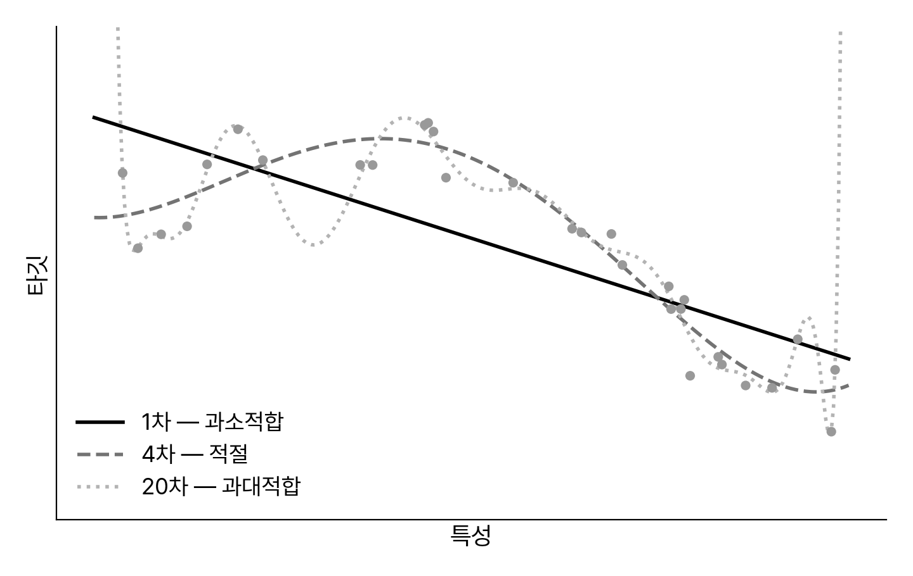
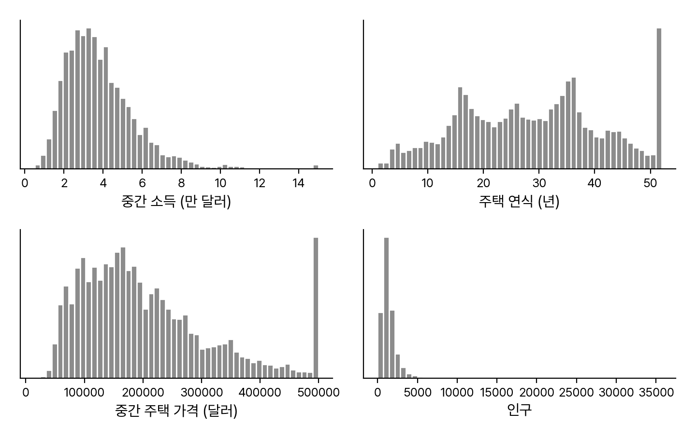
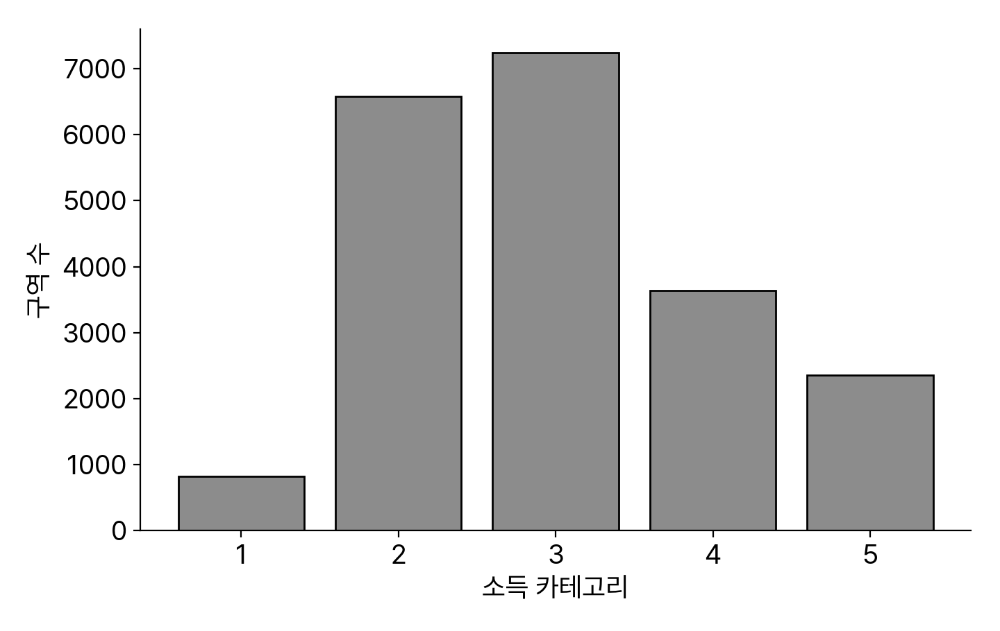
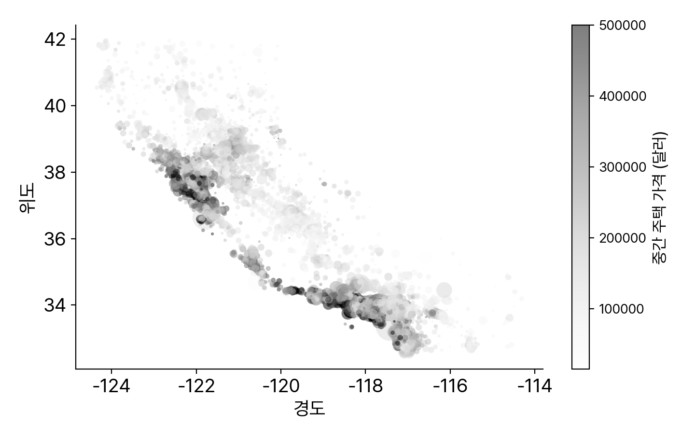
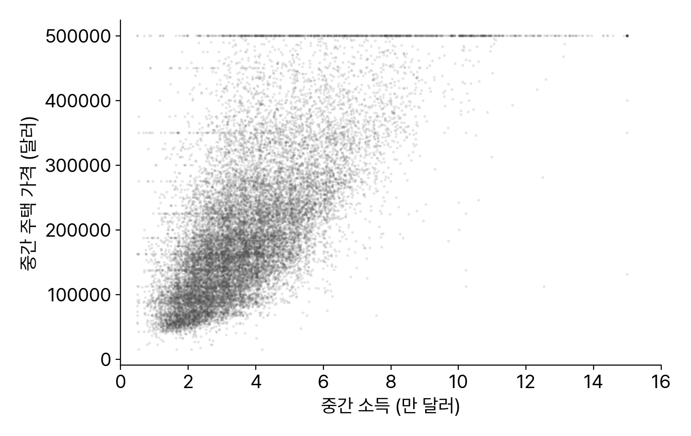
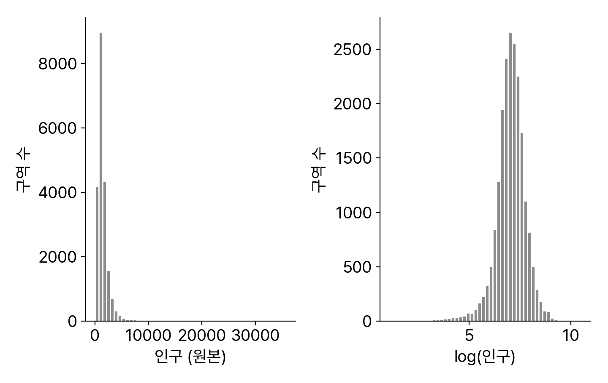

<!-- 덱 설계
청중: 스마트시티학과 2학년. 1~2주차에서 모빌리티 데이터·pandas 기초를 마침. ML 용어는 처음
시간: 화 이론 110분 → 본문 25장 (코드 시연 포함)
메시지: 머신러닝 프로젝트는 모델 코드가 아니라 "문제 정의 → 데이터 → 검증"의 전 과정이다
목표: (1) 지도/비지도 등 ML의 지형과 핵심 용어를 안다 (2) 과대·과소적합과 검증 전략을 설명한다 (3) End-to-End 워크플로우를 캘리포니아 주택 예제로 체득한다
출처: 『핸즈온 머신러닝 3판』 1장(책 27~66), 2장(책 68~141) · 그림은 공개 데이터(ageron/data housing.csv)로 재생성 · 제외: 코랩 사용법(수요일 실습), 사용자 정의 변환기 상세(심화), Ch1·2 연습문제(과제)
-->

# 머신러닝이란

## 머신러닝의 정의
- 머신러닝은 데이터에서 학습하도록 컴퓨터를 프로그래밍하는 것이다.
- 미첼(1997)의 정의: 경험 E로 작업 T의 성능 P가 향상되면 학습이다.
  - 스팸 필터 — T: 스팸 구분, E: 훈련 데이터, P: 정확도
- 데이터를 가졌다고 학습한 것이 아니다 — 성능 P가 좋아져야 한다.
> 새뮤얼(1959)의 고전적 정의("명시적 프로그래밍 없이")도 소개. 반례: 위키백과를 통째로 내려받아도 컴퓨터가 잘하게 되는 작업은 없다. 학생 활동: ETA 예측을 T/E/P에 대입해 보게 한다. 용어 정리: 훈련 세트, 샘플, 모델.

## 왜 머신러닝인가
- 규칙 기반 프로그램은 규칙이 길어지며 유지보수가 무너진다.
  - 스팸 단어 '4U' 차단 → 'For U'로 우회 → 규칙 추가의 무한 반복
- 머신러닝은 패턴을 스스로 학습하고 새 데이터에 자동 적응한다.
- 유리한 지점: 긴 규칙의 문제, 전통 방식이 불가한 문제(음성 인식), 유동적 환경, 대량 데이터에서 인사이트 얻기.
> 그림 1-1~1-4의 순환 구조를 판서로 재현: 문제 연구→규칙 작성→평가 루프가, ML에서는 데이터→훈련→평가 루프로 바뀌고 재훈련이 자동화된다. 데이터 마이닝: 학습된 것을 조사해 사람이 통찰을 얻는 방향.

## 지도 학습과 비지도 학습
- 지도 학습은 레이블(정답)이 달린 데이터로 배운다.
  - 분류(스팸/정상)와 회귀(가격 예측) — 로지스틱 '회귀'는 분류기
- 비지도 학습은 레이블 없이 데이터의 구조를 찾는다.
  - 군집, 시각화·차원 축소, 이상치 탐지, 연관 규칙
- 모빌리티 대응: 수요·ETA 예측은 회귀, 통행 패턴 그룹화는 군집이다.
> 특성=예측 변수=속성, 타깃≈레이블 동의어 정리. 이상치 탐지 vs 특이치 탐지(치와와 예)는 구두로. 차원 축소의 특성 추출(주행거리+연식→마모도)은 1.5 특성 공학과 연결된다고 예고.

## 그 밖의 학습 방식
- 준지도 학습: 일부만 레이블 — 군집으로 묶고 레이블을 전파한다 (구글 포토).
- 자기 지도 학습: 데이터에서 레이블을 스스로 만든다 (이미지 마스킹 복원).
- 강화 학습: 에이전트가 보상을 신호로 정책을 배운다 (알파고 — 14주차).
- 배치 학습 vs 온라인 학습: 한 번에 다 배우느냐, 점진적으로 배우느냐의 축이다.
  - 배치 모델은 낡는다 — 모델 부패·데이터 드리프트
> 세 분류 축(지도 방식 / 배치·온라인 / 사례·모델 기반)은 트리가 아니라 조합 가능한 좌표축임을 강조 — 학생들이 자주 트리로 오해. 온라인 학습의 학습률 트레이드오프와 나쁜 데이터 주입 위험(검색 순위 조작)은 구두로. 외부 메모리 학습은 이름과 달리 보통 오프라인 실행.

## 사례 기반 vs 모델 기반
- 모델 기반: 경향을 식으로 요약한다.
- 사례 기반: 이웃과 비교한다.
- 모델 교체는 코드 두 줄이다.

```python
import pandas as pd
from sklearn.linear_model import LinearRegression

df = pd.read_csv("lifesat.csv")  # 1인당 GDP, 삶의 만족도
X = df[["gdp_per_capita"]].values
y = df["life_satisfaction"].values

model = LinearRegression()       # 모델 기반: 선형 모델
model.fit(X, y)
print(model.predict([[37_655.2]]))  # (결과) [[6.30]]

# 사례 기반으로 바꾸면 — 두 줄만 교체
from sklearn.neighbors import KNeighborsRegressor
model = KNeighborsRegressor(n_neighbors=3)
model.fit(X, y)
print(model.predict([[37_655.2]]))  # (결과) [[6.33]]
```
> OECD 삶의 만족도 예제: 1인당 GDP와 만족도가 대체로 선형 → 모델 선택(선형 모델), 파라미터 θ0·θ1을 비용 함수 최소화로 학습(θ0=3.75, θ1=6.78e-5), 키프로스 예측 6.30. k-최근접 이웃은 가장 가까운 3개국 평균 6.33. '모델'의 세 가지 의미(종류/구조/훈련된 최종 모델)도 언급 — 시험 단골. 프로젝트 4단계: 데이터 분석→모델 선택→훈련→추론.

# 좋은 모델의 조건

## 나쁜 데이터의 네 가지
- 양이 부족하다 — 복잡한 문제일수록 데이터가 많이 필요하다.
- 대표성이 없다 — 1936년 미 대선 여론조사가 표본 편향으로 참패했다.
  - 샘플링 잡음(양의 문제) vs 샘플링 편향(방법의 문제)
- 품질이 낮다 — 오류·이상치·결측의 정제가 실무의 큰 부분이다.
- 특성이 관련 없다 — garbage in, garbage out. 특성 공학이 답이다.
> Literary Digest: 부유층 편중 명부 + 비응답 편향 → 랜던 57% 예측, 실제 루스벨트 62% 당선. 데이터가 충분히 크면 알고리즘 간 차이가 줄어든다는 연구(Banko & Brill 2001)도 소개하되 '충분히 클 때'라는 조건 강조. 토론: 택시 GPS 데이터는 전체 통행을 대표하는가?

## 과대적합과 과소적합
- 너무 단순하면 과소적합이다.
- 너무 복잡하면 과대적합이다.
- 규제가 복잡도에 제약을 건다.
  - 규제 강도 = 하이퍼파라미터


> 과대적합의 일상 비유: 한 번 겪은 일을 전체로 일반화하는 것. 잡음 속 우연한 패턴까지 외우는 게 과대적합("이름에 w가 든 나라는 만족도가 높다" 같은 규칙). 해결책이 서로 대칭: 과대적합은 단순한 모델·더 많은 데이터·잡음 제거, 과소적합은 강한 모델·좋은 특성·규제 완화. 모델 파라미터(훈련으로 학습) vs 하이퍼파라미터(훈련 전 지정, 훈련 중 상수) 구분은 가장 오래 헷갈리는 지점 — 여기서 확실히.

## 테스트와 검증
- 일반화 성능은 새 데이터로만 잰다 — 훈련/테스트를 나눈다 (보통 8:2).
- 테스트 세트로 모델을 고르면 테스트에 과대적합된다.
  - 선택·튜닝용 검증 세트를 따로 둔다 (홀드아웃 검증)
- 검증 세트가 작으면 교차 검증으로 여러 번 평가한다 — 오늘 후반부에 실전.
> 용어: 일반화 오차(외부 샘플 오차)를 테스트 세트로 추정. 훈련 오차는 낮은데 일반화 오차가 크면 과대적합. 검증 세트는 개발 세트·데브 세트라고도 부름. 훈련-개발 세트로 과대적합과 데이터 불일치를 구분하는 기법, 공짜 점심 없음(NFL) 정리는 구두로만: 모든 문제에 최선인 모델은 없다 — 평가해 봐야 안다.

# End-to-End: 문제 정의

## 프로젝트의 8단계
- 머신러닝 프로젝트는 정해진 8단계를 밟는다.
  - ① 큰 그림 ② 데이터 구하기 ③ 탐색·시각화 ④ 데이터 준비
  - ⑤ 모델 선택·훈련 ⑥ 미세 튜닝 ⑦ 솔루션 제시 ⑧ 론칭·유지보수
- 오늘 예제는 캘리포니아 주택 가격이다 — 1990년 인구조사, 20,640개 구역.
- HW2는 같은 8단계를 교통 데이터로 재현하는 과제다.
> 상황 설정: 부동산 회사에 막 입사한 데이터 과학자. 데이터 출처 이야기(OpenML·캐글·공공 포털)를 하며 교통 공공데이터 포털로 연결. 구역=블록 그룹(인구 600~3,000명). 오늘 수업의 남은 세 섹션이 각각 ②③ / ④ / ⑤⑥⑧에 해당한다고 지도를 그려 준다.

## 문제 정의부터 시작한다
- 첫 질문: "모델의 출력이 어디에 쓰이는가?"
  - 예측 가격은 하류 투자 분석 시스템의 입력 — 파이프라인의 한 컴포넌트
- 둘째 질문: "현재 솔루션은 무엇인가?" — 전문가 수동 추정, 오차 30% 이상.
- 답이 문제 유형을 정한다: 지도 학습 · 회귀(다중 입력·단일 출력) · 배치 학습.
> 가정 검사 일화: 하류 시스템이 가격을 '저렴/보통/고가' 카테고리로 바꿔 쓴다면 처음부터 분류 문제였어야 한다 — 모델링 착수 전에 출력 소비 방식을 확인하라는 실무 교훈. 다중 회귀(특성 여러 개) vs 다변량 회귀(출력 여러 개) 용어 구분도 이 지점에서.

## 성능 지표 — RMSE
- 회귀의 기본 지표는 RMSE다 — 오차 제곱 평균의 제곱근.
  - RMSE = √(mean((예측 − 실제)²)), MAE = mean(|예측 − 실제|)
- MAE는 이상치처럼 보이는 구역이 많을 때의 대안이다.
- RMSE는 MAE보다 이상치에 민감하다 — ℓ2 노름 vs ℓ1 노름의 차이.
- 13주차 ETA에서 이 선택이 실제 쟁점이 된다 — 오차 비용의 비대칭.
> 표기법 박스 요약: m(샘플 수), x(i)(특성 벡터), y(i)(레이블), X(행렬, 행=샘플), h(가설·예측 함수). 노름 지수가 클수록 큰 오차에 가중 → RMSE가 이상치에 민감. 이상치가 드물고 분포가 종 모양이면 RMSE가 표준.

# 데이터와 테스트 세트

## 데이터 구조 훑어보기
- 첫 행·타입·결측부터 본다.
- 20,640행 · 특성 10개.
- 결측 207개, 범주형 1개.

```python
housing = pd.read_csv("datasets/housing/housing.csv")

housing.info()
# (결과) 20640 entries, 10 columns
#  total_bedrooms  20433 non-null  ← 207개 결측
#  ocean_proximity object          ← 유일한 범주형

housing["ocean_proximity"].value_counts()
# (결과) <1H OCEAN 9136 / INLAND 6551 / ...

housing.describe()
# count mean std min 25% 50% 75% max
```
> head()로 눈 익히기 → info()로 크기·타입·결측 → value_counts()로 범주 확인 → describe()로 분포 요약. 20,640개는 ML 기준으로 작지만 학습용으로 적절. 백분위수(사분위수) 읽는 법을 여기서 한 번 정리.

## 히스토그램에서 읽는 것
- 소득은 스케일된 값이다.
- 가격·연식에 상한이 있다.
- 특성 간 스케일이 다르다.
- 꼬리가 오른쪽으로 길다.


> 관찰 4가지를 체크리스트로: ① 중간 소득은 달러가 아니라 0.5~15로 스케일된 값(약 만 달러 단위) — 전처리된 특성은 계산 방식을 확인하라 ② 가격 $500k·연식 52년에 상한 캡 — 타깃이 잘려 있으면 심각: 정확한 레이블을 다시 구하거나 해당 구역 제거 ③ 스케일 차이는 뒤의 특성 스케일링으로 ④ 오른쪽 꼬리는 로그 변환으로. 이 그림은 책과 같은 데이터로 직접 그린 것.

## 테스트 세트를 먼저 뗀다
- 모델링 전에 20%를 뗀다.
- 본 데이터는 시험지가 못 된다.
- 낙관 편향 = 데이터 스누핑.

```python
import numpy as np
from sklearn.model_selection import train_test_split

train_set, test_set = train_test_split(
    housing, test_size=0.2, random_state=42)

len(train_set), len(test_set)
# (결과) (16512, 4128)
```
> 테스트 세트 패턴을 보고 모델을 고르면 낙관적 추정 → 론칭 후 기대에 못 미침 = 데이터 스누핑 편향. 직접 구현(무작위 순열)의 문제: 실행마다 달라짐 → seed 고정도 데이터셋 갱신엔 무력 → 식별자 해시(crc32) 방법 소개는 구두로. random_state=42 관례 설명.

## 계층적 샘플링
- 무작위 분할은 비율을 깨뜨린다.
- 소득 5구간으로 층을 나눈다.
- stratify 한 줄이면 된다.


> 설문조사 비유: 성비 51.1:48.9를 유지하도록 층에서 뽑는 것이 계층적 샘플링 — 순수 랜덤 1,000명이면 편향 표본 확률이 약 10.7%. 소득이 가격 예측에 중요하다는 가정 → pd.cut으로 경계 0/1.5/3/4.5/6/∞의 5구간 → train_test_split(stratify=income_cat). 계층 샘플링 오차는 ±0.4%p 이내, 랜덤은 최대 6%p대(책 그림 2-10). 분할 후 income_cat 열은 삭제해 원상 복구.

# 탐색과 데이터 준비

## 지리적 시각화
- 위치·인구·가격을 한 장에 본다.
- 해안·대도시권이 비싸다.
- 시각화가 특성 아이디어를 준다.


> plot(kind="scatter") + alpha로 밀집 지역 부각(베이 에어리어·LA·샌디에이고·센트럴 밸리) → s=인구, c=가격 얹기. 여기서 나오는 특성 공학 아이디어: 군집 중심까지의 거리, 해안 근접성(단, 북부 해안은 비싸지 않아 단순 규칙은 위험). 모빌리티의 공간 데이터 탐색과 그대로 연결 — 2주차 시각화 복습.

## 상관관계와 특성 조합
- 소득의 상관계수가 0.688이다.
- 상관계수는 선형만 잡는다.
- $500k 상한선이 보인다.
- 비율 특성이 원본보다 낫다.
  - bedrooms_ratio −0.256


> corr()로 타깃과의 상관 정렬: median_income 0.688 / latitude −0.140 등. 주의: 피어슨 r은 선형 관계만 — 비선형은 놓치고 기울기와도 무관(책 그림 2-16). 산점도에서 $450k·$350k·$280k의 희미한 수평선도 발견 — 이상 패턴 학습 방지 위해 제거 고려. 특성 조합: rooms_per_house(0.144), bedrooms_ratio(−0.256)가 원본 total_rooms(0.137)·total_bedrooms(0.054)보다 강함 — 구역 크기로 정규화한 비율의 힘. 교통의 '인구당 통행량'과 같은 원리.

## 정제와 범주형 인코딩
- 결측 처리는 셋 중 하나다: 행 삭제, 특성 삭제, 값 대체(imputation).
  - SimpleImputer(strategy="median") — 통계는 훈련 세트에서만 학습
- 변환기 규약: fit은 배우고 transform은 적용한다 — 누수를 막는 장치다.
- 범주형은 원-핫 인코딩한다. 정수 인코딩은 가짜 순서를 만든다.
  - OneHotEncoder는 훈련 때 본 카테고리를 기억한다 (get_dummies와 차이)
> total_bedrooms 결측 207개 → 중간값 대체 채택. 사이킷런 설계 철학(일관성: 추정기 fit/변환기 transform/예측기 predict, 학습된 값은 밑줄 접미사)을 여기서 정리 — 이후 모든 장에서 재사용되는 문법. ocean_proximity처럼 순서 없는 범주에 OrdinalEncoder를 쓰면 "가까운 숫자=비슷함"이라는 거짓 정보가 들어감. 원-핫 출력은 희소 행렬이라는 점, 카테고리가 아주 많으면 임베딩(신경망 파트에서 재등장)이라는 점은 구두로.

## 특성 스케일링과 변환
- 스케일 차이는 학습을 망친다.
- 표준화가 기본값이다.
  - 스케일러도 훈련에만 fit
- 긴 꼬리는 로그로 편다.


> 방 개수 6~39,320 vs 소득 0~15처럼 스케일이 다르면 대부분 알고리즘이 큰 스케일 특성에 편중. min-max 스케일링(0~1, 이상치에 민감) vs 표준화(평균 0·분산 1, 이상치에 강건). 멱법칙 꼬리는 로그 변환으로 대칭화 — 그림처럼 종 모양에 가까워짐. 멀티모달 분포엔 버킷화나 RBF 유사도 특성(구두). 타깃을 변환했으면 예측 후 역변환 — TransformedTargetRegressor.

## 변환 파이프라인
- 전처리를 한 객체로 묶는다.
- 새 데이터에 그대로 재사용한다.
- 튜닝 대상으로도 쓰인다.

```python
from sklearn.pipeline import make_pipeline
from sklearn.compose import (make_column_transformer,
                             make_column_selector as sel)
from sklearn.impute import SimpleImputer
from sklearn.preprocessing import (OneHotEncoder,
                                   StandardScaler)

num_pipe = make_pipeline(
    SimpleImputer(strategy="median"), StandardScaler())
cat_pipe = make_pipeline(
    SimpleImputer(strategy="most_frequent"),
    OneHotEncoder(handle_unknown="ignore"))

preprocessing = make_column_transformer(
    (num_pipe, sel(dtype_include=np.number)),
    (cat_pipe, sel(dtype_include=object)))

X = preprocessing.fit_transform(housing)
```
> Pipeline은 (이름, 추정기) 순차 연결 — 마지막 단계 빼고 전부 변환기. ColumnTransformer로 수치형/범주형에 다른 파이프라인 적용. 하이퍼파라미터 접근은 이중 밑줄 경로(preprocessing__geo__n_clusters) — 다음 섹션 그리드 서치의 복선. 책의 완성본은 비율 특성·로그 변환·지리 군집 유사도까지 넣어 24개 특성을 만든다(노트북 시연). 이 슬라이드가 2장의 하이라이트: 전처리 전체가 fit_transform 한 줄로 재현된다.

# 모델 선택과 튜닝

## 훈련 오차의 함정
- 선형 회귀의 훈련 RMSE는 68,688 — 가격대 대비 크다: 과소적합.
- 결정 트리의 훈련 RMSE는 0.0 — 완벽이 아니라 과대적합 경고음이다.
- 훈련 오차만으로는 아무것도 판정할 수 없다 — 검증이 필요하다.
- 테스트 세트는 아직 꺼내지 않는다.
> make_pipeline(preprocessing, LinearRegression()) → fit → predict 시연. 중간 주택 가격이 대부분 $120k~$265k인데 오차 $68k는 못 쓰는 수준 — 특성 부족이거나 모델이 약함(과소적합). 트리 0.0에서 학생들에게 "좋은 건가?"라고 물어보고 다음 슬라이드로.

## 교차 검증
- 훈련 오차 0은 경고음이다.
- 격차가 진단 기준이다.
- 후보 2~5개를 먼저 추린다.

표: 세 모델의 훈련·10폴드 교차 검증 RMSE
| 모델 | 훈련 | 교차 검증 | 진단 |
|---|---|---|---|
| 선형 회귀 | 68,688 | 69,858 | 과소적합 |
| 결정 트리 | 0.0 | 66,868 | 과대적합 |
| 랜덤 포레스트 | 17,474 | 47,020 | 개선, 여전히 과대 |
> k-폴드: 훈련 세트를 10조각 내 10번 훈련·평가 — 성능 추정치와 함께 그 표준편차(정확도)도 얻는다(트리 ±2,061, 선형 ±4,182). 비용은 훈련 k배. cross_val_score는 효용 함수 관례라 음수 RMSE 반환 — 부호 반전 주의. 읽는 법: 훈련≈검증이면 과소적합, 훈련≪검증이면 과대적합. 랜덤 포레스트가 크게 앞서므로 이 모델로 튜닝 진행 — 단, 한 모델에 몰빵하기 전에 후보 2~5개를 추리는 것이 원칙.

## 하이퍼파라미터 튜닝
- GridSearchCV는 모든 조합을 교차 검증으로 평가한다.
  - 파이프라인째 넣으면 전처리 선택지도 튜닝된다 (이중 밑줄 __)
- 탐색 공간이 크면 RandomizedSearchCV — 예산 고정, 연속값 탐색.
- 튜닝으로 검증 RMSE 47,020 → 44,042로 개선됐다.
- 최적값이 탐색 범위의 끝이면 범위를 넓혀 다시 찾는다.
> 예제: 지리 군집 수 × 트리 max_features 15조합 × 3폴드 = 45회 훈련, best는 n_clusters=15·max_features=6. best_estimator_는 refit으로 전체 훈련 세트 재훈련. 랜덤 서치 장점: 중요하지 않은 하이퍼파라미터에 예산을 안 씀, scipy 분포로 연속 탐색. HalvingSearch(자원 늘려가며 후보 걸러내기), 앙상블(오차 유형이 다른 모델 평균 — 7장 예고), feature_importances_로 오차 분석(소득 로그가 최상위)은 구두로.

## 테스트 세트 평가
- 테스트 세트는 마지막에 딱 한 번 쓴다 — 최종 RMSE 41,424.
- 점 추정으로 끝내지 않는다 — 95% 신뢰 구간 [39,275, 43,467].
- 결과가 아쉬워도 테스트 세트에 맞춰 재튜닝하면 안 된다.
- 결론은 말로 남긴다 — "중간 소득이 가장 강력한 예측 변수다".
> scipy.stats.t.interval로 일반화 오차의 신뢰 구간. 튜닝을 많이 했으면 테스트가 교차 검증보다 살짝 나쁜 게 정상 — 그 격차를 테스트 재튜닝으로 메우는 순간 일반화가 깨진다. 발표·문서화까지가 ⑦솔루션 제시 단계.

## 론칭과 오늘의 요약
- 모델을 저장(joblib)해 배포하고, 성능을 모니터링한다.
  - 데이터는 변한다 — 정기 재훈련 루프까지가 시스템이다 (MLOps)
- 오늘의 한 문장: ML 프로젝트는 모델 코드가 아니라 전 과정이다.
- 다음 주(4주차): 모델 훈련의 내부 — 경사하강법과 규제 (핸즈온 Ch4).
  - HW2(End-to-End를 교통 데이터로 재현) 이번 주 배포, 5주차 마감
> joblib.dump/load, 웹 서비스(REST API)나 클라우드 배포, 입력 데이터 품질 감시·백업과 롤백 등 2.8의 운영 체크리스트를 훑는다. 목표 (1)(2)(3) 회수: ML 지형(섹션 1~2), 검증 전략(섹션 2·6), End-to-End(섹션 3~6). 연습문제로 캐글에 계정 만들고 관심 데이터셋 하나 골라 보기를 권장 — 2.9의 취지.
