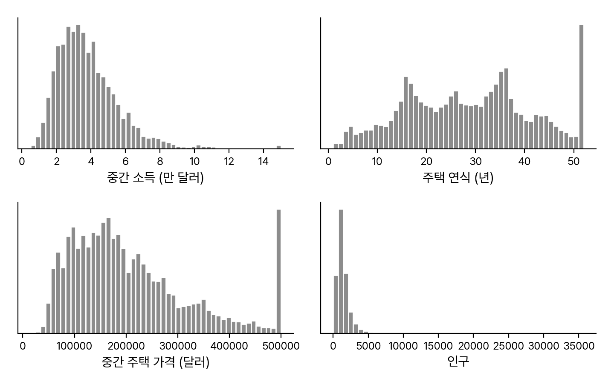
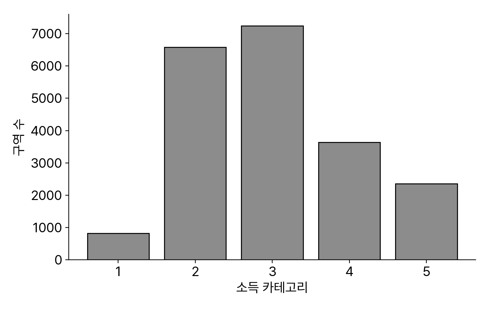
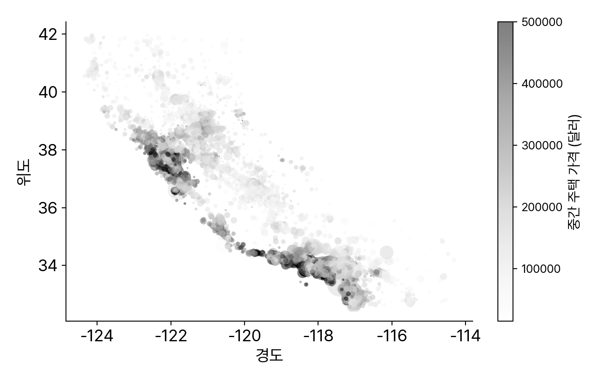
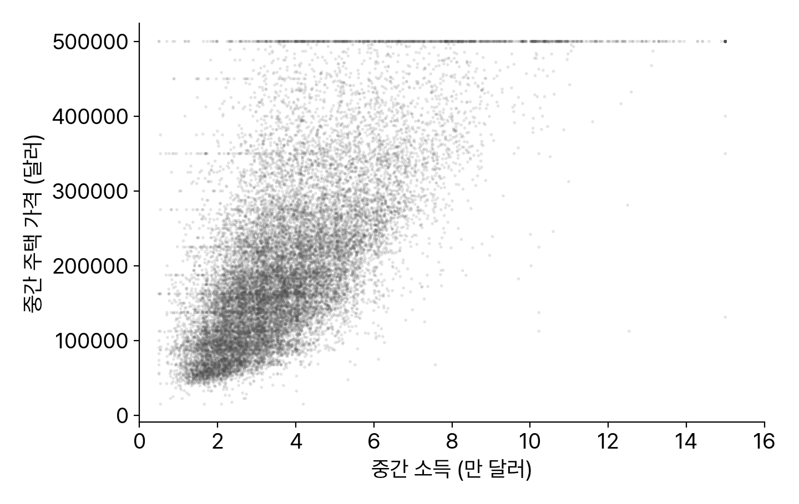

<!-- 덱 설계
교재: 『핸즈온 머신러닝 3판』 Ch2
코드: handson-ml3의 02_end_to_end_machine_learning_project.ipynb
원칙: 슬라이드는 작업 순서와 판단할 지점만 보여 준다. 코드는 공식 노트북에서 실행한다.
-->

# 프로젝트 시작

## 오늘 할 일

- 캘리포니아 주택 가격 예제를 처음부터 끝까지 실행
- 데이터 탐색과 전처리
- 모델 비교와 최종 평가

> Ch1 내용은 반복하지 않습니다. 교재 Ch2와 공식 노트북을 나란히 열고 같은 순서로 진행합니다.

## 전체 순서

1. 문제와 평가 기준 정하기
2. 데이터 살펴보기
3. 학습용 데이터 준비하기
4. 모델 비교하고 조정하기
5. 최종 성능 확인하기

> 이 순서는 5주차부터 사용할 제주 통행속도 데이터와 학기 말 버스 ETA 프로젝트에도 그대로 적용합니다.

## 무엇을 예측할 것인가

- 입력: 구역별 인구·소득·위치 정보
- 출력: 중간 주택 가격
- 문제 유형: 지도 학습·회귀
- 평가 지표: RMSE

> 먼저 예측값이 어디에 쓰이는지 확인합니다. 하류 시스템이 가격 구간만 필요하다면 회귀가 아니라 분류 문제일 수 있습니다.

# 데이터 살펴보기

## 크기·자료형·결측값

- 20,640행, 10개 열
- 수치형 9개, 범주형 1개
- `total_bedrooms`에 결측값 207개

> 공식 노트북에서 `head()`, `info()`, `value_counts()`, `describe()`를 차례로 실행합니다. 출력에서 무엇을 확인하는지 학생에게 먼저 묻습니다.

## 분포에서 확인할 것

> 소득의 단위, 가격과 연식의 상한, 서로 다른 값의 범위, 오른쪽으로 긴 꼬리를 확인합니다. 그래프를 고치기 전에 데이터가 어떻게 만들어졌는지부터 묻습니다.

## 모델을 만들기 전에 평가 데이터를 분리한다

- 전체 데이터의 20%를 테스트 데이터로 보관
- 이후 탐색과 전처리는 훈련 데이터만 사용
- 테스트 데이터는 최종 평가 때 확인

> 제목의 뜻을 그대로 설명합니다. 평가에 사용할 데이터를 미리 따로 보관하고, 모델을 고치는 동안에는 보지 않습니다. 공식 노트북의 `train_test_split` 코드를 실행합니다.

## 중요한 비율을 유지해서 나눈다

> 주택 가격과 관련이 큰 소득을 구간으로 나누고, 각 구간의 비율이 훈련과 테스트 데이터에 비슷하게 남도록 계층 샘플링합니다.

# 탐색과 전처리

## 지도에서 패턴 찾기

> 해안과 대도시 주변의 가격이 높은지 살펴봅니다. 모빌리티 데이터도 지도에 표시하면 거리나 권역 같은 새 특성을 떠올릴 수 있습니다.

## 관계와 새 특성 찾기

- 상관계수는 선형 관계만 보여 줌
- 가격 상한으로 생긴 수평선 확인
- 방 수 자체보다 가구당 방 수처럼 비율을 검토

> 공식 노트북의 상관계수와 산점도를 함께 봅니다. 상관계수만 보고 판단하지 않고 그래프에서 이상한 패턴을 찾습니다.

## 전처리에서 결정할 것

| 문제 | 처리 예 |
|---|---|
| 결측값 | 중간값 대체 |
| 범주형 값 | 원-핫 인코딩 |
| 값의 범위 차이 | 표준화 |
| 긴 꼬리 | 로그 변환 |

> `fit`은 훈련 데이터에서 필요한 값을 배우고, `transform`은 그 값을 적용합니다. 중간값과 스케일을 전체 데이터에서 계산하면 누수가 생깁니다.

## 전처리를 파이프라인으로 묶는다

- 수치형 열과 범주형 열을 다르게 처리
- 학습할 때와 예측할 때 같은 순서 적용
- 교차 검증 안에서도 전처리를 다시 학습

> 공식 노트북의 `Pipeline`과 `ColumnTransformer` 셀을 실행합니다. 긴 코드를 외우기보다 왜 한 객체로 묶는지를 설명합니다.

# 모델 비교와 평가

## 훈련 성능만으로 고르지 않는다

| 모델 | 훈련 RMSE | 교차 검증 RMSE | 해석 |
|---|---:|---:|---|
| 선형 회귀 | 68,688 | 69,858 | 과소적합 |
| 결정 트리 | 0 | 66,868 | 과대적합 |
| 랜덤 포레스트 | 17,474 | 47,020 | 가장 나음 |

> 훈련 오차가 0인 결정 트리가 왜 가장 좋은 모델이 아닌지 묻습니다. 공식 노트북에서 교차 검증 결과와 표준편차를 확인합니다.

## 설정값을 조정한다

- `GridSearchCV`: 정한 조합을 모두 평가
- `RandomizedSearchCV`: 정한 횟수만큼 무작위 탐색
- 선택 기준은 교차 검증 성능

> 전처리와 모델을 묶은 파이프라인 전체를 탐색에 넣습니다. 가장 좋은 값이 탐색 범위의 끝에 있으면 범위를 다시 정합니다.

## 최종 성능 확인

- 선택이 끝난 모델에 테스트 데이터 사용
- 테스트 RMSE와 신뢰 구간 보고
- 테스트 결과를 보고 다시 조정하지 않음
- 모델과 전처리를 함께 저장

> 공식 노트북의 마지막 평가와 모델 저장 부분을 실행합니다. 운영에서는 입력 데이터와 예측 성능이 변하는지도 계속 확인해야 합니다.

# 정리

## 오늘 확인할 질문

- 테스트 데이터는 언제부터 사용할 수 있는가?
- 전처리도 파이프라인에 넣어야 하는 이유는 무엇인가?
- 훈련 오차가 0이면 왜 의심해야 하는가?

> 다음 주에는 Ch4를 보며 `fit()` 안에서 선형 모델이 어떻게 학습되는지 살펴봅니다.
