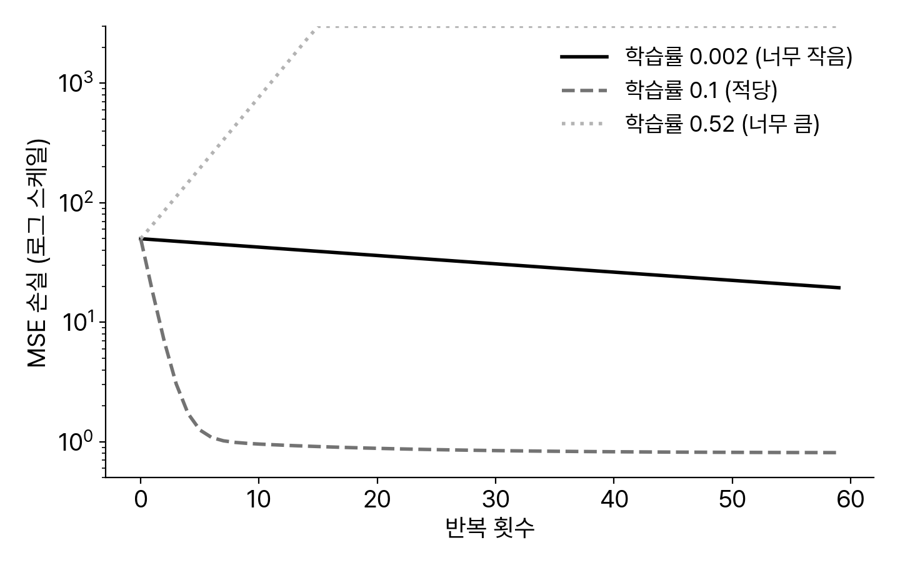
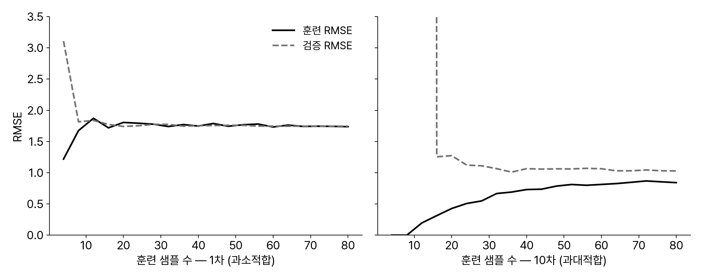
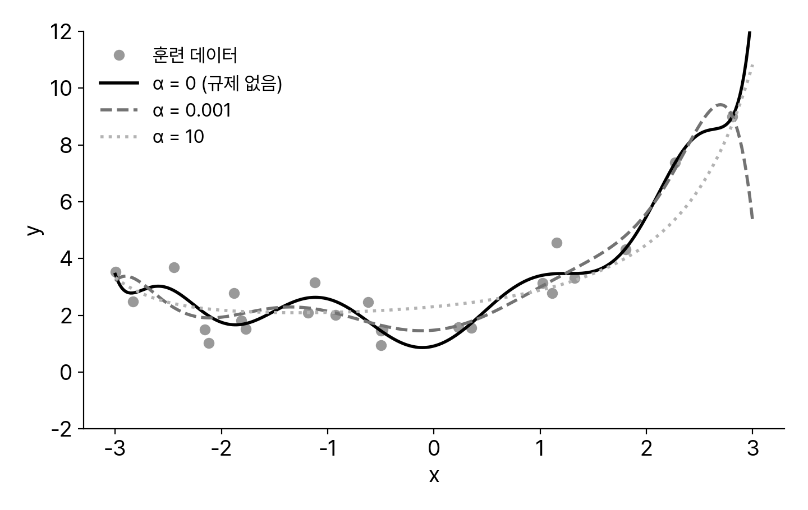
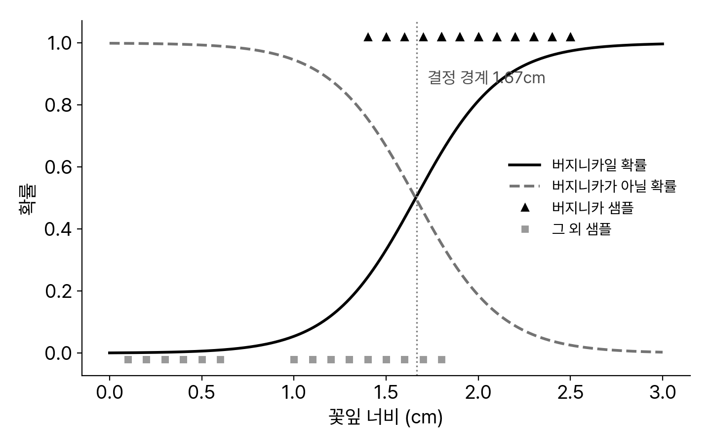

<!-- 덱 설계
청중: 스마트시티학과 2학년. 3주차에서 End-to-End 워크플로우를 마침 — 모델을 "써 봤지만" 내부는 모름
시간: 화 이론 110분 → 본문 20장 (수식은 최소, 그림·코드 중심)
메시지: 훈련이란 손실 함수를 경사하강법으로 최소화하는 것이다 — 이 원리가 6주차 신경망과 10주차 PyTorch까지 그대로 이어진다
목표: (1) 선형 회귀의 손실과 두 해법(정규방정식·경사하강법)을 구분한다 (2) 학습 곡선으로 과소·과대적합을 진단하고 규제로 대응한다 (3) 로지스틱·소프트맥스와 분류 지표(정밀도·재현율)를 읽는다
출처: 『핸즈온 머신러닝 3판』 4장(책 191~239), 3장 3.3절 발췌 · 그림·수치는 책과 같은 합성 데이터·붓꽃 데이터로 직접 재생성 · 제외: 정규방정식 유도·SVD 상세(심화), SGD 수렴 정리, PR·ROC 곡선 그리기(수요일 실습), 4장 연습문제
-->

# 선형 회귀

## 모델과 파라미터
- 선형 회귀는 특성의 가중 합으로 예측한다.
  - ŷ = θ₀ + θ₁x₁ + ⋯ + θₙxₙ — 편향 θ₀ + 가중치 θ₁…θₙ
- 훈련이 찾는 것은 파라미터 θ다 — 모델 구조는 사람이, 값은 데이터가 정한다.
- 3주차 캘리포니아 예제의 선형 회귀가 바로 이 식이다 — 오늘은 그 fit() 내부를 연다.
> 1주차 ETA 예로 번역: 도착시간 ≈ θ₀ + θ₁×거리 + θ₂×시간대 + θ₃×직전 구간 속도. 파라미터(훈련으로 학습) vs 하이퍼파라미터(사람이 지정) 구분을 3주차에 이어 복습. 벡터 표기 ŷ = θᵀx는 판서로만 — 수식 공포를 줄이는 게 이번 주 목표라고 말해 준다.

## 손실 함수 — 좋은 θ의 기준
- "가장 잘 맞는 θ"를 정의해야 찾을 수 있다 — 기준이 손실 함수다.
- 회귀의 표준 손실은 MSE다: 오차 제곱의 평균.
  - MSE(θ) = mean((ŷ⁽ⁱ⁾ − y⁽ⁱ⁾)²) — 3주차 RMSE의 제곱
- 훈련 = MSE(θ)를 최소로 만드는 θ 찾기 — 이것이 4장 전체의 문제 설정이다.
- 최소화 방법이 두 갈래다: 식으로 한 번에(정규방정식), 반복해서 조금씩(경사하강법).
> 성능 지표(RMSE, 사람이 보는 값)와 훈련 손실(MSE, 최적화가 보는 값)이 살짝 다를 수 있다는 점 — 미분 편의로 MSE를 쓰고 보고는 RMSE로. 손실 함수라는 개념 자체가 7주차 신경망(교차 엔트로피)까지 그대로 확장된다고 예고.

## 정규방정식 — 닫힌 해
- 선형 회귀는 답을 식으로 바로 계산할 수 있다.
- 잡음 때문에 원래 값(4, 3)은 못 맞춘다.
- 특성이 아주 많아지면 계산이 무거워진다.
  - 반복 없이 한 번에 — 대신 특성 수에 민감

```python
import numpy as np
from sklearn.linear_model import LinearRegression

np.random.seed(42)
m = 100
X = 2 * np.random.rand(m, 1)
y = 4 + 3 * X + np.random.randn(m, 1)   # 진짜 관계: 4 + 3x

lin_reg = LinearRegression()
lin_reg.fit(X, y)
print(lin_reg.intercept_, lin_reg.coef_)
# (결과) [4.215] [[2.770]]  ← 잡음 탓에 4, 3과 약간 차이
```
> 정규방정식 θ̂ = (XᵀX)⁻¹Xᵀy를 칠판에 쓰되 유도는 생략 — "미분해서 0 되는 지점"이라는 한 문장으로. 사이킷런은 실제로는 SVD 기반 유사역행렬(수치 안정성). 복잡도는 특성 수 n에 대해 O(n²~³), 샘플 수 m에는 선형 — 특성 10만 개면 사실상 불가, 그래서 다음 섹션의 경사하강법이 필요하다는 다리를 놓는다.

# 경사하강법

## 기울기의 반대 방향으로
- 경사하강법은 손실이 줄어드는 방향으로 θ를 조금씩 옮긴다.
  - θ ← θ − η × ∇MSE(θ) — η(학습률)만큼 내리막으로 한 걸음
- 무작위 초기화에서 출발해 기울기가 0에 가까워질 때까지 반복한다.
- MSE는 볼록 함수라 지역 최솟값 걱정이 없다 — 전역 최솟값 하나뿐.
- 신경망의 손실은 볼록이 아니다 — 같은 알고리즘, 더 험한 지형 (7주차).
> 안개 낀 산에서 발밑 경사만 보고 내려가기 비유는 구두로. ∇는 "각 θ 방향의 기울기를 모은 벡터" 정도로만. 수치 예를 하나 손으로: θ=0에서 기울기가 음수면 θ를 키운다. 다음 슬라이드에서 η가 왜 문제인지로 연결.

## 학습률 — 첫 번째 하이퍼파라미터
- 너무 작으면 하염없이 느리다.
- 너무 크면 발산한다.
- 적당하면 수십 번에 수렴한다.
- 6주차 이후 계속 만나는 값이다.


> 그림은 앞 코드와 같은 데이터의 배치 GD 실측 — 0.002는 60회로는 어림없고, 0.52는 손실이 10³으로 폭발(그래프는 3,000에서 클리핑). 실무 요령: 로그 스케일로 3~4개(0.001/0.01/0.1/1) 찍어 보고 좁히기. 발산 징후는 손실이 커지는 것 — 학습 곡선을 늘 그려 보라는 습관을 여기서 심는다.

## 특성 스케일과 수렴
- 특성 스케일이 다르면 손실 지형이 길쭉해져 수렴이 느려진다.
  - 방 개수(수천) vs 소득(0~15) — 3주차 히스토그램에서 이미 봤다
- 경사하강법을 쓸 때는 표준화가 사실상 전제 조건이다.
- 정규방정식은 스케일에 둔감하다 — 해법에 따라 전처리 요구가 다르다.
> 책 그림 4-7: 스케일이 같으면 밥그릇(곧장 최소로), 다르면 길쭉한 계곡(지그재그로 오래). 3주차 StandardScaler가 "왜" 필요했는지가 여기서 닫힌다 — 파이프라인에 스케일러를 넣어 둔 이유. 트리 계열은 스케일 무관이라는 대비는 다음 주 복선.

## 세 가지 변형
- 한 걸음에 쓰는 데이터 양이 셋을 가른다.
- 확률적·미니배치는 요동이 있는 대신 빠르다.
  - 요동은 학습률을 점점 줄여 다스린다 (학습 스케줄)

표: 경사하강법 세 변형의 비교
| 변형 | 한 걸음의 데이터 | 속도 | 수렴 |
|---|---|---|---|
| 배치 GD | 전체 m개 | 큰 데이터에서 느림 | 안정적 |
| 확률적 SGD | 1개 | 가장 빠름 | 요동, 탈출 능력 |
| 미니배치 | 수십~수백 개 | GPU에 유리 | 절충 |
> SGD의 요동이 단점만은 아님 — 비볼록 지형에서 지역 최솟값을 튀어나오는 힘(신경망에서 중요). 미니배치가 딥러닝의 표준인 이유는 행렬 연산 하드웨어 최적화. "에포크"(전체 데이터 한 바퀴) 용어를 여기서 도입 — 7주차부터 매주 쓴다.

## 코드로 — SGDRegressor
- 확률적 경사하강법으로 같은 문제를 푼다.
- 정규방정식 해(4.215, 2.770)와 거의 같다.
- 무작위성 탓에 실행마다 조금 다르다.

```python
from sklearn.linear_model import SGDRegressor

sgd_reg = SGDRegressor(max_iter=1000, tol=1e-5,
                       penalty=None, eta0=0.01,
                       random_state=42)
sgd_reg.fit(X, y.ravel())

print(sgd_reg.intercept_, sgd_reg.coef_)
# (결과) [4.150] [2.828]  ← 닫힌 해와 근사, 동일하진 않음
```
> penalty=None은 "규제 없음"(뒤 섹션에서 켠다), eta0는 초기 학습률, tol은 진전이 없으면 조기 중단. "반복 학습이 왜 필요한가"라는 질문에 대한 답: 특성이 많거나 데이터가 커서 닫힌 해가 불가능할 때, 그리고 애초에 닫힌 해가 없는 모델(신경망)일 때 — 후자가 이 과목의 나머지 전부.

# 다항 회귀와 학습 곡선

## 다항 회귀 — 특성으로 비선형을
- 특성의 거듭제곱을 새 특성으로 추가하면 선형 모델로 곡선을 학습한다.
- 모델은 여전히 "선형" — 파라미터에 대해 선형이면 도구가 그대로 통한다.
- 학습된 계수가 원래 함수(0.5x² + x + 2)를 근사한다.

```python
from sklearn.preprocessing import PolynomialFeatures

np.random.seed(42)
X = 6 * np.random.rand(100, 1) - 3
y = 0.5 * X**2 + X + 2 + np.random.randn(100, 1)

poly = PolynomialFeatures(degree=2, include_bias=False)
X_poly = poly.fit_transform(X)   # 열이 [x, x²] 두 개로

lin_reg = LinearRegression().fit(X_poly, y)
print(lin_reg.intercept_, lin_reg.coef_)
# (결과) [1.78] [[0.93 0.56]]  ← 2 + 1.0x + 0.5x² 근사
```
> 3주차의 비율 특성(rooms_per_house)과 같은 발상 — 좋은 특성을 만들면 단순한 모델로 복잡한 관계를 잡는다. degree를 300으로 올리면? → 훈련 데이터를 다 외우는 과대적합(3주차 fig_fit 복습). 그 진단 도구가 다음 슬라이드의 학습 곡선.

## 학습 곡선으로 진단한다
- 훈련·검증 오차를 훈련 샘플 수에 따라 그리면 과소·과대적합이 보인다.
- 과소적합: 두 곡선이 높은 값에서 붙어 정체 — 데이터를 더 넣어도 소용없다.
- 과대적합: 훈련 오차는 낮고 검증과 격차 — 데이터 추가가 도움이 된다.


> 같은 2차 데이터에 1차/10차 모델을 적합한 실측 곡선. 읽는 순서를 훈련시키기: ① 두 곡선의 높이(절대 성능) ② 두 곡선의 격차(과대적합 정도) ③ 곡선의 기울기(데이터 추가의 기대 효과). 3주차 교차 검증 표(선형 68,688/69,858 vs 트리 0/66,868)를 이 틀로 다시 읽어 보게 한다 — 같은 진단, 다른 도구.

## 편향과 분산
- 일반화 오차는 세 성분의 합이다 — 편향² + 분산 + 줄일 수 없는 오차.
  - 편향: 모델의 잘못된 가정 (2차 관계를 1차로) → 과소적합
  - 분산: 훈련 데이터의 잡음에 민감 (10차 다항) → 과대적합
  - 줄일 수 없는 오차: 데이터 자체의 잡음 — 정제로만 감소
- 복잡도를 올리면 편향은 줄고 분산은 는다 — 한쪽만 좋아지는 공짜는 없다.
- 다음 섹션의 규제는 분산을 줄이는 대표 도구다.
> 트레이드오프라는 말의 정확한 의미를 여기서: 목표는 편향·분산의 합이 최소인 지점이지 어느 하나의 최소가 아님. ETA로 번역 — 모든 노선에 같은 평균 속도를 쓰면 편향, 특정 요일 우연까지 외우면 분산. 이 세 단어(편향·분산·잡음)는 중간고사 단골이라고 예고.

# 규제

## 릿지 — 가중치를 작게
- 손실에 가중치 크기 벌점을 더한다.
  - MSE + α × Σθᵢ² (ℓ2)
- α가 클수록 곡선이 순해진다.
- 규제 전에 스케일링이 필수다.


> 그림: 같은 24개 점에 10차 다항 — α=0은 점 사이를 요동, α=0.001만으로 크게 순해지고, α=10은 거의 2차 곡선. "복잡한 모델을 주되 날뛰지 못하게 고삐"라는 비유는 구두로. 벌점이 θ 스케일에 의존하므로 표준화 없이는 특정 특성만 부당하게 벌받음. 편향 θ₀는 규제하지 않는다는 관례도 언급. α는 하이퍼파라미터 — 3주차 그리드 서치로 고른다.

## 라쏘와 엘라스틱넷
- 라쏘는 벌점을 절댓값으로 준다 — MSE + α × Σ|θᵢ| (ℓ1).
- 라쏘는 덜 중요한 가중치를 정확히 0으로 만든다 — 자동 특성 선택.
  - 특성 수십 개 중 몇 개만 유효할 때 모델이 저절로 골라 준다
- 엘라스틱넷은 둘의 혼합 — 특성이 샘플보다 많거나 강하게 상관될 때 라쏘보다 안정적.
- 기본 선택: 약간의 릿지. 특성 선택이 필요하면 엘라스틱넷부터.
> ℓ1이 왜 0을 만드는지는 등고선-마름모 그림을 판서로 간단히(모서리에서 만남). ETA 특성 후보 수십 개(요일·시간대·날씨·이벤트…) 중 뭐가 유효한지 모를 때 라쏘 계수를 보는 실전 사용법 — 13주차 프로젝트에서 써먹을 수 있는 도구로 소개.

## 조기 종료
- 반복 학습에서는 검증 오차가 다시 오르는 순간이 과대적합의 시작이다.
- 검증 오차가 최소인 시점의 모델을 저장해 두고 거기서 멈춘다 — 조기 종료.
- 규제 항 없이 반복 횟수만으로 규제 효과를 낸다 — 구현도 공짜에 가깝다.
- 신경망 훈련의 기본 장치다 — 10주차 PyTorch에서 직접 구현한다.
> 에포크에 따른 훈련/검증 RMSE 곡선을 판서로: 훈련은 계속 내려가고 검증은 U자. 제프리 힌턴의 "beautiful free lunch" 인용은 구두로. copy.deepcopy로 최적 시점 모델을 보관하는 구현 요령, patience(몇 에포크 기다릴지) 개념은 실습 노트북에서.

# 분류로 확장

## 로지스틱 회귀
- 회귀의 출력을 확률로 바꾼다.
  - σ(t) = 1 / (1 + e⁻ᵗ) — 0~1 사이
- 확률 0.5가 결정 경계다.
- 붓꽃 데이터: 경계 1.67cm.
- 이름은 회귀, 하는 일은 분류.


> 선형 회귀로 분류하면 안 되는 이유(확률이 0~1을 벗어남, 이상치에 결정 경계가 끌려감)를 먼저 묻고 시그모이드 도입. 손실은 로그 손실(교차 엔트로피) — MSE가 아닌 이유는 "확신에 찬 오답에 큰 벌"을 주기 위해서라고 직관만. 닫힌 해가 없어 경사하강법으로 푼다 — 오늘 배운 도구가 바로 재사용되는 첫 사례. 그림은 붓꽃 petal width 단일 특성 실측(경계 1.67cm).

## 소프트맥스 회귀
- 클래스가 셋 이상이면 시그모이드 대신 소프트맥스를 쓴다.
  - 클래스별 점수를 계산 → 지수화·정규화 → 합이 1인 확률 벡터
- 가장 높은 확률의 클래스를 답한다 — 붓꽃 3품종 분류가 표준 예제.
- 손실은 교차 엔트로피 — 정답 클래스에 준 확률이 낮을수록 벌점.
- 7주차 신경망의 출력층이 정확히 이 구조다 — 이름까지 그대로.
> LogisticRegression(C=30)이 다중 클래스에서 자동으로 소프트맥스 사용(사이킷런). C는 α의 역수(작을수록 강한 규제) — 라이브러리마다 규제 표기가 다르다는 함정 언급. 여기까지가 Ch4, 이제 "분류를 몇 점이라고 말할 것인가"로 전환 — Ch3 발췌.

## 혼동 행렬 — 틀림의 두 종류
- 분류의 틀림은 두 방향이다 — 거짓 양성(FP)과 거짓 음성(FN).
- 정확도 하나로는 두 방향이 안 보인다 — 클래스가 불균형하면 특히.
  - 돌발상황이 1%뿐이면 "항상 정상" 모델도 정확도 99%

표: 혼동 행렬 — 실제 × 예측
| | 예측: 양성 | 예측: 음성 |
|---|---|---|
| 실제: 양성 | TP (참 양성) | FN (거짓 음성) |
| 실제: 음성 | FP (거짓 양성) | TN (참 음성) |
> 책 3장의 MNIST '5 감지기'로 도입된 내용을 발췌해 교통 예로 치환: 돌발상황 감지기에서 FP=허위 경보, FN=놓친 사고. "정확도 99%가 왜 무의미한가"를 학생에게 계산시키기(불균형 1%). 행렬의 행=실제, 열=예측 방향은 라이브러리마다 다르니 항상 확인하라는 실무 주의.

## 정밀도와 재현율
- 정밀도 = TP / (TP+FP) — 양성이라 말한 것 중 진짜 비율.
- 재현율 = TP / (TP+FN) — 진짜 양성 중 잡아낸 비율.
- 둘은 임계값을 사이에 두고 시소를 탄다 — 문턱을 낮추면 재현율↑ 정밀도↓.
- F1은 둘의 조화 평균 — 하나의 숫자가 필요할 때의 절충.
> 책 수치: MNIST 5 감지기의 정밀도 0.84, 재현율 0.65 — "5라고 하면 84% 맞지만, 실제 5의 35%는 놓친다"로 읽는 연습. 임계값을 movable로 이해시키기: 로지스틱의 0.5는 기본값일 뿐 조정 대상. PR 곡선·ROC/AUC는 이름과 용도만 소개하고 수요일 실습에서 그려 본다.

## 어떤 지표를 쓰는가
- 지표 선택은 통계가 아니라 오류의 비용 구조가 정한다.
- 회귀도 마찬가지였다 — RMSE vs MAE (3주차), ETA의 비대칭 비용 (13주차).

표: 문제별 오류 비용과 우선 지표
| 문제 | 치명적 오류 | 우선 지표 |
|---|---|---|
| 돌발상황·사고 감지 | 놓침 (FN) | 재현율 |
| 자동 단속·과금 | 허위 적발 (FP) | 정밀도 |
| 수요 예측 (회귀) | 큰 오차 | RMSE·MAE |
> "무엇을 틀리면 더 아픈가"라는 질문 하나로 지표를 고르게 하는 훈련 — LLM에게 모델을 시키는 시대에 사람이 반드시 해야 하는 판단이라는 점을 강조. 팀 프로젝트(BIS ETA) 보고서에서도 지표 선택 근거를 요구할 것이라고 예고.

# 마무리

## 요약과 다음 주
- 훈련 = 손실 함수 최소화, 도구는 경사하강법 — 학습률·스케일링이 수렴을 결정.
- 진단은 학습 곡선(격차), 처방은 규제(릿지·라쏘)와 조기 종료.
- 분류는 로지스틱·소프트맥스로, 평가는 정밀도·재현율로 — 지표는 비용이 정한다.
- 다음 주(5주차): 결정 트리와 앙상블 — 정형 데이터의 주력 모델 (핸즈온 Ch6·7).
  - HW1(데이터 정제·시각화) 이번 주 마감 · 수요일 실습은 Ch4 노트북
> 목표 회수: (1) 정규방정식 vs 경사하강법(섹션 1~2) (2) 학습 곡선·규제(섹션 3~4) (3) 분류와 지표(섹션 5). 오늘 배운 손실·경사·학습률·규제·조기 종료는 6~7주차 신경망에서 전부 재등장 — "새 개념이 아니라 같은 개념의 큰 모델 버전"이라는 안심을 주며 마무리. 5주차의 트리는 반대로 경사하강법을 안 쓰는 모델이라는 대비도 흥미 포인트로.
