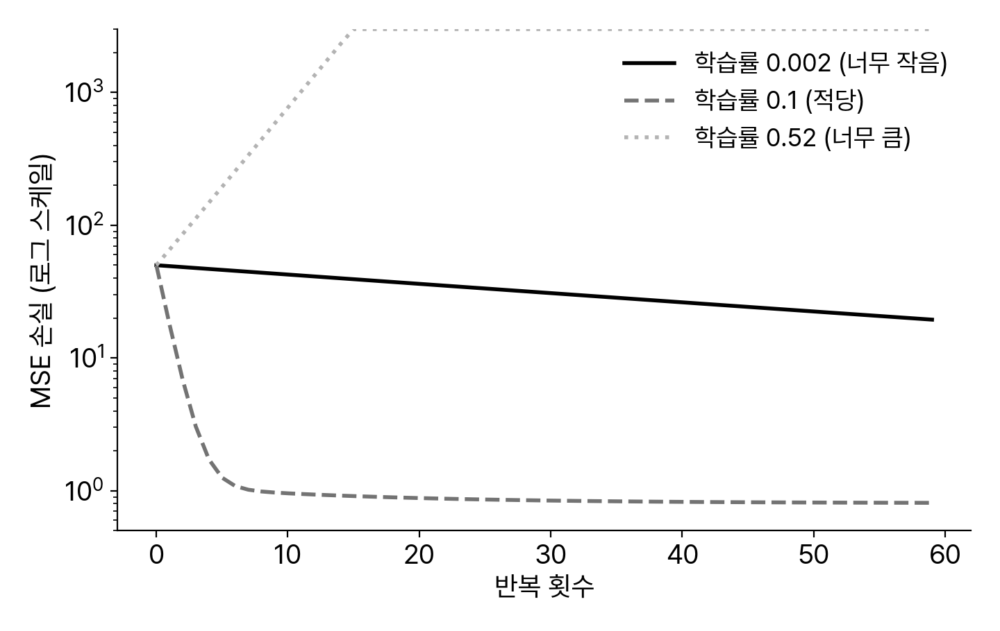
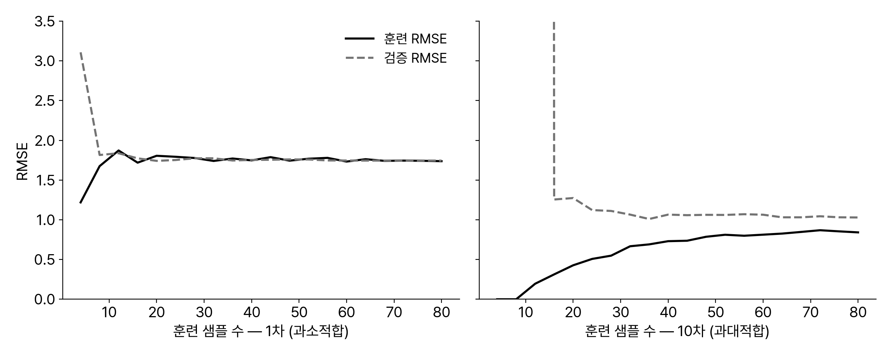
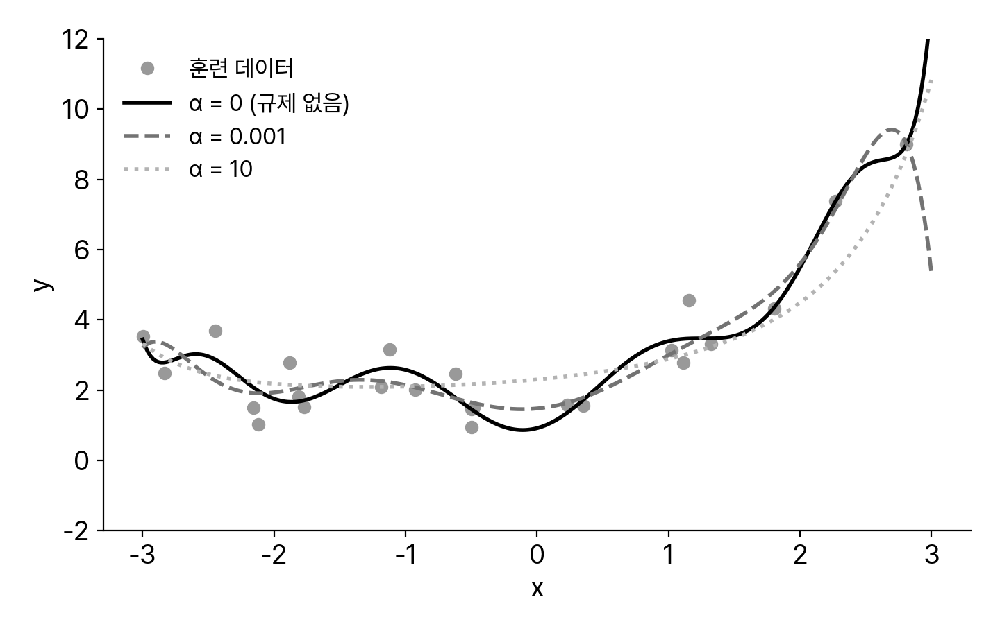
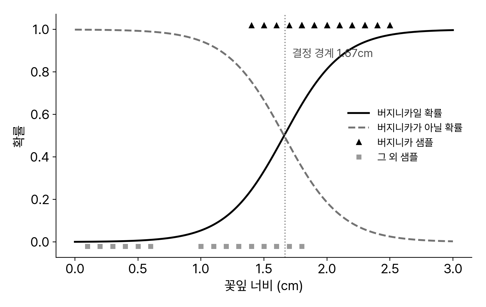

<!-- 덱 설계
교재: 『핸즈온 머신러닝 3판』 Ch4, Ch3의 혼동 행렬·정밀도·재현율
코드: 04_training_linear_models.ipynb, 03_classification.ipynb
원칙: 수식은 의미를 읽는 데 필요한 만큼만 다루고, 계산과 그래프는 공식 노트북에서 확인한다.
-->

# 선형 회귀

## 오늘 볼 내용

- 선형 회귀는 어떻게 학습하는가
- 과대적합을 어떻게 확인하고 줄이는가
- 분류 모델은 어떻게 학습하고 평가하는가

> 3주차에는 모델을 사용했습니다. 오늘은 공식 Ch4 노트북을 실행하며 `fit()` 안에서 일어나는 일을 살펴봅니다.

## 모델과 손실 함수

- 예측: ŷ = θ₀ + θ₁x₁ + ⋯ + θₙxₙ
- 학습할 값: θ
- 기준: 평균 제곱 오차(MSE)

> 버스 ETA라면 거리, 시간대, 직전 구간 속도에 붙는 가중치를 찾는 문제입니다. 학습은 MSE가 가장 작아지는 θ를 찾는 과정입니다.

## 답을 찾는 두 방법

| 방법 | 방식 | 적합한 경우 |
|---|---|---|
| 정규방정식 | 식으로 한 번에 계산 | 특성 수가 많지 않을 때 |
| 경사하강법 | 손실을 줄이며 반복 | 큰 데이터·복잡한 모델 |

> 공식 노트북의 선형 회귀 예제로 두 방법의 결과를 비교합니다. 정규방정식 유도와 SVD 세부 내용은 다루지 않습니다.

# 경사하강법

## 손실이 줄어드는 쪽으로 이동한다

θ ← θ − η × ∇MSE(θ)

- ∇MSE: 손실이 커지는 방향
- η: 한 번에 움직이는 크기, 학습률

> 산비탈 비유로 방향만 설명한 뒤, 노트북에서 파라미터가 반복할 때마다 어떻게 바뀌는지 확인합니다.

## 학습률에 따라 결과가 달라진다

> 학습률이 너무 작을 때와 너무 클 때를 그래프에서 찾게 합니다. 손실이 줄어드는지 기록하는 것이 가장 먼저 할 진단입니다.

## 한 번에 얼마나 많은 데이터를 쓰는가

| 방법 | 한 번의 업데이트에 사용 |
|---|---|
| 배치 경사하강법 | 전체 데이터 |
| 확률적 경사하강법 | 한 샘플 |
| 미니배치 경사하강법 | 일부 샘플 |

> 공식 노트북에서 배치·확률적·미니배치 경사하강법의 경로를 비교합니다. 딥러닝에서는 미니배치를 주로 사용합니다.

# 복잡도와 규제

## 특성을 추가해 곡선을 학습한다

- x², x³ 같은 특성을 추가
- 선형 모델로 비선형 관계 표현
- 차수를 지나치게 높이면 과대적합

> 공식 노트북의 다항 회귀 셀에서 1차, 2차, 고차 모델의 곡선을 비교합니다.

## 학습 곡선을 읽는다

- 두 오차가 모두 크고 비슷함: 과소적합
- 훈련 오차만 낮고 차이가 큼: 과대적합

> 곡선의 높이, 훈련과 검증의 차이, 데이터가 늘 때의 변화를 순서대로 확인합니다.

## 가중치를 제한한다

| 방법 | 벌점 | 특징 |
|---|---|---|
| 릿지 | 가중치의 제곱 | 가중치를 전반적으로 줄임 |
| 라쏘 | 가중치의 절댓값 | 일부 가중치를 0으로 만듦 |
| 엘라스틱넷 | 두 벌점의 조합 | 두 방법의 성질을 함께 사용 |

> 규제 전에는 특성의 스케일을 맞춰야 합니다. 공식 노트북에서 α가 커질 때 곡선이 어떻게 달라지는지 확인합니다.

## 가장 좋은 시점에서 멈춘다

- 훈련 오차는 계속 감소
- 검증 오차는 다시 증가할 수 있음
- 검증 오차가 가장 낮은 모델을 저장

> 이것이 조기 종료입니다. 10주차 PyTorch 실습에서도 같은 방식으로 구현합니다.

# 분류로 확장

## 로지스틱 회귀와 소프트맥스 회귀

- 로지스틱 회귀: 두 클래스의 확률 예측
- 소프트맥스 회귀: 여러 클래스의 확률 예측
- 학습 손실: 교차 엔트로피

> Ch4 공식 노트북의 붓꽃 예제를 실행합니다. 로지스틱 회귀는 이름과 달리 분류 모델입니다.

## 정확도만 보면 놓치는 것

| | 예측: 양성 | 예측: 음성 |
|---|---|---|
| 실제: 양성 | TP | FN |
| 실제: 음성 | FP | TN |

> Ch3 공식 노트북으로 이동해 혼동 행렬을 확인합니다. 사고 감지에서 FP는 허위 경보, FN은 놓친 사고입니다.

## 정밀도와 재현율

- 정밀도: 양성이라고 예측한 것 중 실제 양성의 비율
- 재현율: 실제 양성 중 찾아낸 비율
- 임계값을 바꾸면 두 값도 함께 바뀜

> 놓침이 더 위험한지, 허위 경보가 더 위험한지에 따라 지표와 임계값을 정합니다. 공식 노트북의 정밀도–재현율 곡선을 확인합니다.

# 정리

## 오늘 확인할 질문

- 학습률이 너무 크면 손실은 어떻게 되는가?
- 학습 곡선에서 과대적합은 어떻게 보이는가?
- 사고 감지에서는 정밀도와 재현율 중 무엇을 우선할까?

> 다음 주에는 경사하강법을 쓰지 않는 결정 트리와, 여러 트리를 결합하는 방법을 배웁니다.
