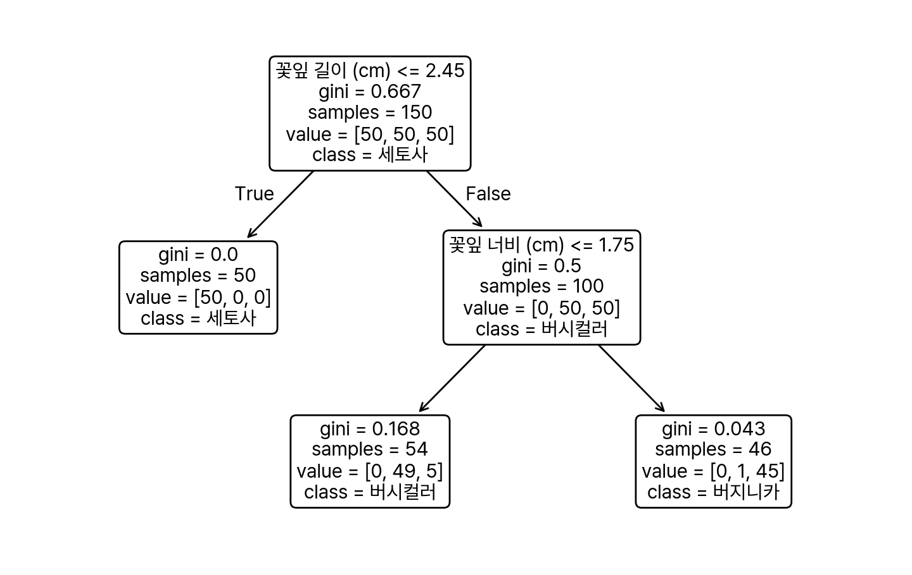
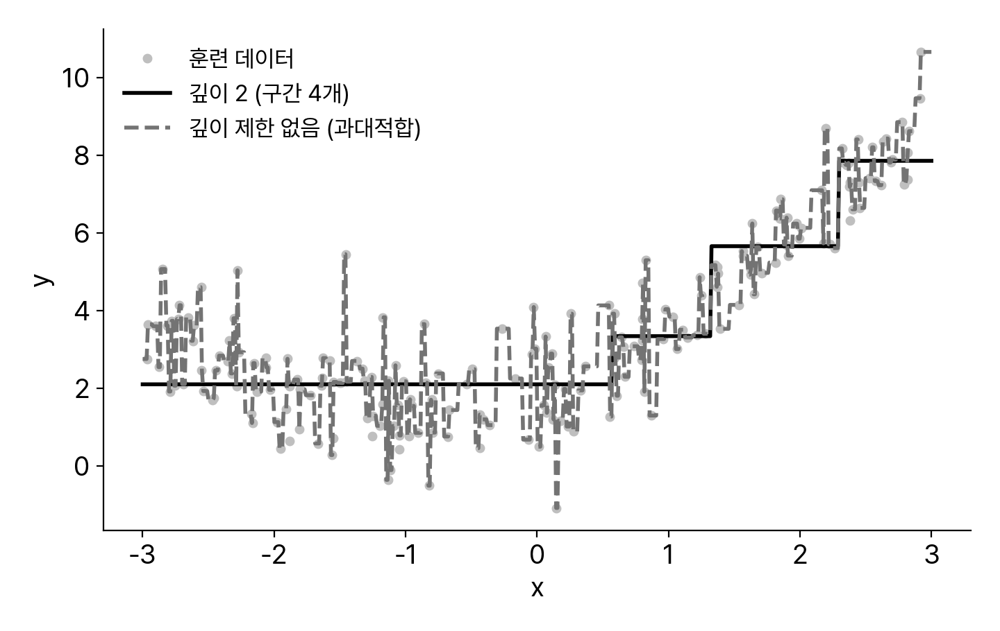
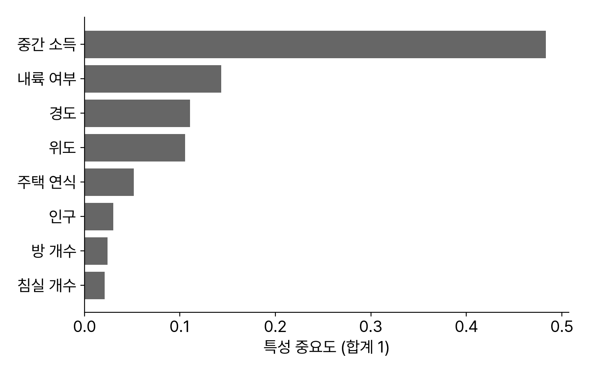
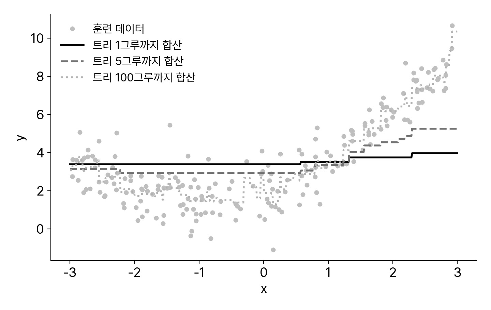

<!-- 덱 설계
청중: 스마트시티학과 2학년. 3주차 워크플로우, 4주차 경사하강법·규제·지표까지 마침. 3주차 교차 검증 표에서 트리·랜덤 포레스트를 결과로만 봤음
시간: 화 이론 110분 → 본문 18장 (코드 시연 3회 포함)
메시지: 표 형태(정형) 데이터의 기본기는 트리 앙상블이다 — 약한 모델 여럿이 强한 모델 하나를 이기고, 13주차 BIS ETA 프로젝트의 1차 후보가 바로 이것이다
목표: (1) 트리의 분할 원리(CART·지니)와 과대적합 규제를 설명한다 (2) 배깅→랜덤 포레스트, 부스팅→그레이디언트 부스팅의 원리를 구분한다 (3) 특성 중요도를 해석하고 문제에 맞는 모델을 고른다
출처: 『핸즈온 머신러닝 3판』 6장(책 251~269), 7장(책 271~301) · 수치는 책과 같은 moons·붓꽃·캘리포니아 데이터로 직접 재계산 (0.912, 0.904, OOB 0.925 모두 책과 일치) · 제외: 스태킹 상세, AdaBoost 수식, XGBoost 설치·튜닝(수요일 실습), 6·7장 연습문제
-->

# 결정 트리

## 질문을 이어 가는 모델
- 트리는 스무고개처럼 예/아니오 질문을 이어 예측한다.
- 경로가 곧 근거다 — 예측 이유를 사람에게 설명할 수 있다.
- 스케일링이 필요 없다 — 4주차 모델과 다른 점.


> 그림 읽는 법을 처음부터: 꽃잎 길이 2.45cm 이하면 세토사 50개 전부 분리(gini 0), 아니면 너비 1.75cm로 재분할. value=[0, 49, 5]는 "이 잎에 도착한 훈련 샘플의 클래스 분포". 화이트박스(트리) vs 블랙박스(신경망) 대비 — 교통 행정에 설명이 필요한 장면(왜 이 노선이 지연 예측인가)과 연결. 4주차 "스케일링 필수"가 트리에선 불필요한 이유: 분할은 대소 비교만 쓴다.

## CART와 지니 불순도
- 학습 = "어떤 특성의 어떤 값에서 자를까"의 반복이다.
- CART는 자식 노드의 불순도가 가장 낮아지는 분할을 고른다.
  - 지니 불순도: 클래스가 섞일수록 큼 (한 클래스뿐이면 0)
- 한 번에 하나의 최선만 보는 탐욕적 알고리즘 — 전체 최적은 보장하지 않는다.
- 분할을 멈출 때까지(깊이 제한·샘플 수 제한) 재귀적으로 반복한다.
> 지니 계산을 그림의 깊이-2 왼쪽 잎으로 직접: 1 − (49/54)² − (5/54)² = 0.168. 엔트로피 기준도 있으나 결과가 비슷하고 지니가 약간 빠름 — criterion 하이퍼파라미터로 선택 가능 정도만. "최적 트리 찾기는 NP-완전, 그래서 탐욕법"은 한 문장으로. 모든 분할이 축에 수직이라는 특성(계단형 경계)은 다음 회귀 트리 그림에서 눈으로 확인.

## 회귀 트리
- 잎의 값 = 그 구간 훈련 샘플의 평균.
- 예측 함수는 계단 모양이 된다.
- 깊이 제한이 없으면 잡음까지 외운다.
- 분할 기준은 지니 대신 MSE.


> 4주차와 같은 2차 곡선 데이터에 DecisionTreeRegressor를 적합한 실측. 깊이 2 = 구간 4개의 평균으로 뭉뚱그림(과소적합 기미), 제한 없음 = 점 하나하나를 쫓아 요동(과대적합) — 3주차 교차 검증 표에서 트리의 훈련 RMSE가 0.0이었던 이유가 이 그림에 있다. ETA로 번역: "출근 시간대 + 이 구간이면 평균 12분" 식의 구간 평균 예측기.

## 규제 하이퍼파라미터
- 트리는 두면 끝까지 자란다 — 구조가 데이터에 맞춰 정해지는 비파라미터 모델.
- 자유도를 제한하는 손잡이가 규제다.
  - max_depth·max_leaf_nodes: 크기 상한 / min_samples_leaf: 잎의 최소 샘플
- min_* 을 키우거나 max_* 을 줄이면 규제가 세진다 — 방향만 기억하면 된다.
- 4주차 릿지의 α와 같은 역할 — 벌점 대신 구조 제한이라는 방식만 다르다.
> moons 데이터로 min_samples_leaf=4를 준 트리가 무제한 트리보다 테스트 성능이 좋아지는 책 그림 6-3을 구두로 소개. "규제"라는 개념이 모델 계열마다 옷만 갈아입고 반복된다는 큰 그림(선형: 벌점 / 트리: 구조 제한 / 신경망: 드롭아웃 — 10주차) — 중간고사에서 관통 질문으로 낼 만한 지점.

## 트리의 불안정성
- 데이터가 조금 바뀌면 트리 전체가 확 바뀐다 — 분산이 큰 모델.
  - 첫 분할이 달라지면 그 아래가 전부 달라지는 구조 탓
- 축에 수직인 분할만 가능해 데이터 회전에도 민감하다.
- 개별 트리의 약점(높은 분산)이 다음 섹션의 출발점이다 — 여럿을 평균하면?
> 책 실험: 훈련 세트에서 가장 넓은 버시컬러 하나만 빼도 전혀 다른 트리가 학습됨(그림 6-8). random_state를 고정해야 재현되는 이유도 여기 있음. "불안정하다 = 쓸모없다"가 아니라 "불안정하다 = 평균할 재료로 좋다"로 뒤집는 것이 앙상블의 발상 — 다음 장으로 다리.

# 배깅과 랜덤 포레스트

## 여러 모델의 투표
- 서로 다른 모델 셋의 다수결이 개별 최고를 이긴다.
- 0.864 / 0.896 / 0.896 → 투표 0.912.
- 조건: 모델들이 서로 다른 실수를 해야 한다.

```python
from sklearn.ensemble import (VotingClassifier,
                              RandomForestClassifier)
from sklearn.linear_model import LogisticRegression
from sklearn.svm import SVC
from sklearn.datasets import make_moons
from sklearn.model_selection import train_test_split

X, y = make_moons(n_samples=500, noise=0.30,
                  random_state=42)
X_tr, X_te, y_tr, y_te = train_test_split(
    X, y, random_state=42)

voting = VotingClassifier([
    ('lr', LogisticRegression(random_state=42)),
    ('rf', RandomForestClassifier(random_state=42)),
    ('svc', SVC(random_state=42))])
voting.fit(X_tr, y_tr)
print(voting.score(X_te, y_te))  # (결과) 0.912
```
> 초승달(moons) 데이터 소개 한 장 없이 코드에서 바로 — 2차원 합성 분류 데이터라고만. 개별 점수(lr 0.864, rf 0.896, svc 0.896)는 직접 실행한 값이자 책과 동일. "가장 좋은 모델 하나만 남기면 되지 않나?"라는 질문을 던지고 다음 슬라이드(왜 되는가)로. 확률 평균을 쓰는 soft voting이 보통 더 좋다는 건 구두로.

## 왜 모이면 나아지는가
- 51% 확률로 맞히는 동전도 1,000번 던져 다수결하면 4분의 3을 넘는다 — 큰 수의 법칙.
- 전제는 독립성이다 — 같은 실수를 하는 모델 1,000개는 한 개와 같다.
- 같은 알고리즘만 있어도 독립성을 만들 수 있다 — 데이터를 다르게 주면 된다.
  - 그 방법이 배깅: 훈련 세트를 중복 허용 무작위 샘플링(부트스트랩)
- 대중의 지혜가 성립하는 조건과 무너지는 조건을 모델로 옮긴 것이다.
> 동전 계산: p=0.51 동전 1,000번의 다수결 적중 확률 ≈ 75%, 10,000번이면 97%(책 수치). 단, 완전 독립 가정하의 이상치이고 실제 모델들은 상관돼 있어 이만큼은 못 얻는다는 단서까지. 배깅(중복 허용) vs 페이스팅(중복 없음) 용어는 이름만. 앙상블 오차가 줄어드는 건 주로 분산 성분 — 4주차 편향·분산 언어로 설명.

## 배깅과 OOB 평가
- 같은 트리 500그루: 0.856 → 0.904.
- 각 트리가 못 본 37% 샘플이 공짜 검증 세트다 — OOB.
- OOB 0.925 — 별도 검증 없이 성능 추정.

```python
from sklearn.ensemble import BaggingClassifier
from sklearn.tree import DecisionTreeClassifier

bag = BaggingClassifier(
    DecisionTreeClassifier(random_state=42),
    n_estimators=500, max_samples=100,
    oob_score=True, random_state=42)
bag.fit(X_tr, y_tr)

print(bag.score(X_te, y_te))
# (결과) 0.904  ← 단일 트리 0.856
print(bag.oob_score_)
# (결과) 0.925
```
> 부트스트랩에서 각 트리가 평균적으로 훈련 샘플의 63%만 보고 37%는 못 본다(OOB) — 그 샘플로 그 트리를 평가하면 검증 세트를 아낀다. OOB와 테스트 점수의 차이(0.925 vs 0.904)는 추정의 분산 때문 — "공짜지만 오차 있는 추정"으로 소개. 병렬 훈련 가능(n_jobs=-1)이라 500그루도 금방이라는 실용 포인트.

## 랜덤 포레스트
- 랜덤 포레스트 = 트리 배깅 + 분할마다 특성도 무작위 추출.
  - 무작위성 두 겹(샘플·특성)으로 트리들의 상관을 더 줄인다
- 개별 트리는 더 나빠지고, 숲은 더 좋아진다 — 분산 감소가 편향 증가를 이긴다.
- 사실상의 기본 모델이다 — 3주차 캘리포니아 예제에서 이미 주력이었다.
  - moons에서 500그루 숲: 0.912 (직접 실행)
> RandomForestClassifier(n_estimators=500, max_leaf_nodes=16) = BaggingClassifier(DecisionTree(...)) 최적화 버전과 동일하다는 점. 3주차 표(RF 교차 검증 47,020으로 선형·트리 압도)를 "이제 원리를 안다"로 회수. 엑스트라 트리(분할 임계값까지 무작위)는 이름만. 하이퍼파라미터는 트리 것 + n_estimators — 많을수록 좋고 시간과 타협.

## 특성 중요도
- 숲은 특성별 기여도를 공짜로 준다.
- 중간 소득 0.48로 압도적 — 3주차 상관 분석과 일치.
- 탐색·설명·특성 선택에 쓴다.
- 인과가 아니라 기여도다.


> 3주차 housing 데이터로 직접 학습한 실측(중간 소득 0.483, 내륙 여부 0.143, 경도 0.110, 위도 0.105). 계산 원리: 그 특성으로 분할했을 때 불순도가 얼마나 줄었는가의 가중 평균. 주의 두 가지 — ① 상관된 특성끼리 중요도를 나눠 가짐(경도·위도) ② "중요하다 ≠ 원인이다". ETA 프로젝트 보고서에서 "어떤 특성이 예측을 끌고 가는가" 분석 도구로 요구할 예정.

# 부스팅

## 순차적으로 오차를 보정
- 배깅은 병렬 — 독립적으로 만들어 평균한다. 부스팅은 직렬 — 앞의 실수를 뒤가 고친다.
- AdaBoost: 이전 모델이 틀린 샘플의 가중치를 키워 다음 모델을 훈련한다.
- 그레이디언트 부스팅: 이전 모델의 잔차(남은 오차)에 다음 모델을 적합한다.
- 순차 훈련이라 병렬화가 어렵다 — 대신 정형 데이터 성능의 정점.
> "받아쓰기 시험에서 틀린 문제만 다시 공부하는 학생" 비유는 구두로. AdaBoost는 아이디어만(가중치 갱신 수식 생략), 이후는 그레이디언트 부스팅 중심으로 — 실무에서 쓰는 건 후자 계열. 잔차에 적합한다 = 경사하강법을 "함수 공간"에서 한다는 심화 관점은 궁금한 학생용 한 마디로만.

## 그레이디언트 부스팅
- 트리 1: 큰 흐름만. 트리 5: 곡선이 살아남. 트리 100: 세부까지.
- 각 트리는 얕다(깊이 2) — 약한 학습기의 합.
- 합산 예측 = 트리들의 출력 합 × 학습률.


> 같은 2차 데이터에 GradientBoostingRegressor(max_depth=2, lr=0.1) 실측. 그루 수가 늘며 잔차가 깎여 가는 과정을 애니메이션처럼 설명 — 1그루는 평균 수준, 5그루에서 곡선 형태, 100그루면 데이터를 촘촘히 따름. "100그루가 더 좋은가?"를 묻고 — 오른쪽 끝 요동을 가리키며 과대적합 위험으로 다음 슬라이드 연결.

## 학습률과 트리 수
- 학습률(shrinkage)은 각 트리의 기여를 줄인다 — 작게 + 많이 = 일반화 유리.
- 트리 수가 너무 많으면 과대적합 — 검증 오차가 다시 오르는 지점에서 멈춘다.
  - 4주차 조기 종료가 그대로 재사용된다 (n_iter_no_change)
- 핵심 손잡이 셋: n_estimators · learning_rate · max_depth.
- 학습률과 트리 수는 반비례 관계로 함께 움직인다 — 하나만 조이면 안 된다.
> staged_predict로 그루 수에 따른 검증 오차 곡선을 그려 최적 지점을 찾는 실습은 수요일 노트북에서. 4주차에 배운 조기 종료·학습률·규제 개념이 전부 부스팅 튜닝 언어로 재등장한다는 점을 명시적으로 짚기 — "새 지식이 아니라 조합"이라는 안도감. 히스토그램 기반(HistGradientBoosting)의 속도 이점은 이름만.

## XGBoost·LightGBM
- 그레이디언트 부스팅의 고성능 구현체들 — 정형 데이터 대회 상위권의 단골.
  - XGBoost · LightGBM · CatBoost — 규제 내장, 결측 처리, GPU 지원
- 사이킷런 문법과 거의 같다 — fit/predict 그대로.
- 13주차 BIS ETA 프로젝트의 1차 베이스라인이 XGBoost다.
- 도구는 LLM이 짜 준다 — 사람의 일은 검증 설계와 결과 해석이다.
> import xgboost; XGBRegressor() 한 줄 시연 정도(설치는 수요일). 캐글 정형 데이터 우승 솔루션의 다수가 부스팅 계열이라는 관례적 사실 + "그래서 딥러닝은 왜 배우나?"라는 질문을 일부러 던져 다음 섹션·다음 주로 넘기는 훅. LLM에게 "XGBoost로 ETA 모델 짜 줘"라고 하면 코드는 나온다 — 시간 순서를 무시한 분할로 짜 주는 경우가 많다는 함정(12~13주차 핵심)을 예고.

# 실전 선택

## 모델 비교
- 4주 동안 만난 모델 계열을 한 표로 놓는다 — 만능은 없다.

표: 모델 계열의 성격 비교 (3~5주차 종합)
| 계열 | 성능(정형) | 해석 | 전처리 요구 |
|---|---|---|---|
| 선형·로지스틱 | 기준선 | 계수 직독 | 스케일링 필요 |
| 결정 트리 1개 | 낮음 | 경로 직독 | 거의 없음 |
| RF·배깅 | 좋음 | 중요도 | 거의 없음 |
| 부스팅 | 최상급 | 중요도 | 거의 없음 |
> "항상 부스팅?"에 대한 균형: 선형 모델은 5분 만에 도는 기준선이자 이상 징후 탐지기(기준선보다 못한 복잡 모델 = 어딘가 잘못됨), 트리 1개는 설명·교육용, RF는 튜닝 없이 강함, 부스팅은 튜닝하면 최강. 3주차 "후보 2~5개를 추려라"와 연결 — 이 표가 그 후보 목록. NFL 정리(3주차 구두)의 실전 버전.

## 정형 데이터에서의 위치
- 표 형태 데이터에서는 트리 앙상블이 신경망과 대등하거나 앞서는 일이 흔하다.
- 신경망의 힘은 이미지·시퀀스·텍스트 같은 비정형에서 나온다 — 6주차부터.
- 13~14주차 BIS ETA에서 XGBoost vs MLP vs Transformer를 같은 조건으로 비교한다.
  - 어떤 모델이 이길지는 데이터가 정한다 — 미리 단정하지 않는다
- 배웠다고 쓰는 게 아니라, 문제가 고르게 한다 — 이 과목의 반복 주제.
> 정형 데이터 벤치마크들에서 부스팅이 심층 모델을 이기는 보고가 이어져 왔다는 사실(Grinsztajn et al. 2022 등)을 "경향"으로만 — 데이터 크기·특성 구성에 따라 뒤집힌다는 단서와 함께. 다음 주부터 신경망으로 넘어가는 이유를 여기서 명확히: ETA의 시퀀스 입력(최근 구간 통행시간의 흐름)은 정형 표로 잘 안 담긴다 — 11~12주차 Transformer의 예고편.

# 마무리

## ML 파트 정리
- 3주차: 프로젝트는 전 과정이다 — 문제 정의·분할·파이프라인·검증.
- 4주차: 훈련은 손실 최소화다 — 경사하강법·학습 곡선·규제·지표.
- 5주차: 정형 데이터의 주력은 트리 앙상블이다 — 배깅·부스팅·중요도.
- 이 세 주가 중간고사(9주차, 1~7주차 범위)의 ML 부분 전부다.
> 세 줄이 각 주의 "한 문장 메시지" — 이 요약 형식을 시험 대비 노트로 권장. 코드보다 판단(어느 지표, 어느 분할, 어느 모델, 왜)을 묻는 문제가 나온다고 다시 예고 — LLM 시대에 사람이 하는 일이 바로 그 판단이므로.

## 다음 주 — 신경망
- 다음 주(6주차)부터 딥러닝 파트 — 『밑바닥부터 시작하는 딥러닝 1』 지참.
  - 퍼셉트론에서 시작해 numpy로 신경망을 직접 만든다
- 4주차의 경사하강법·손실 함수가 그대로 신경망의 훈련 원리가 된다.
- HW2(End-to-End를 교통 데이터로 재현) 이번 주 마감.
  - 수요일 실습: Ch6·7 노트북 + XGBoost 설치·첫 실행
> 밑바닥 Ch1(파이썬 기초)은 자습 범위였음을 상기. "딥러닝은 어렵다"는 인상을 미리 눅이기: 오늘까지 배운 손실·경사·규제가 부품의 전부이고, 신경망은 그 부품의 재조립이라는 메시지로 마무리.
