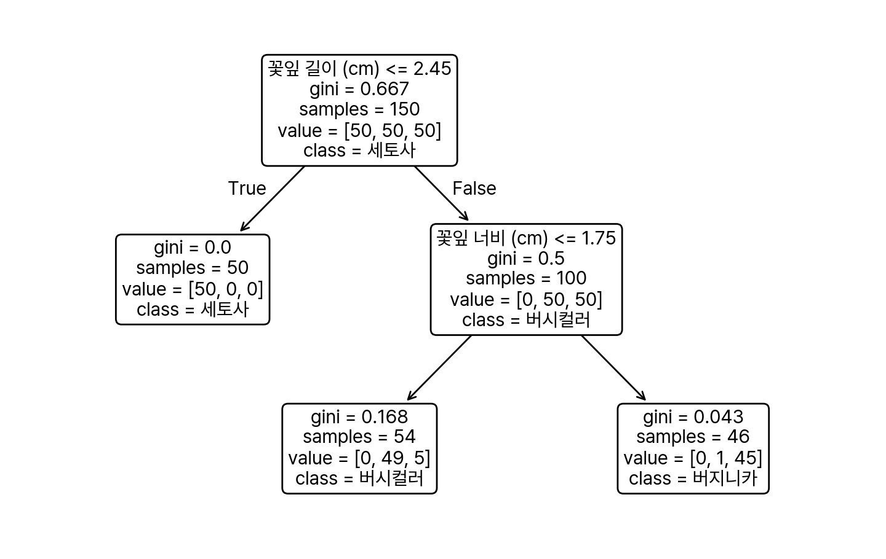
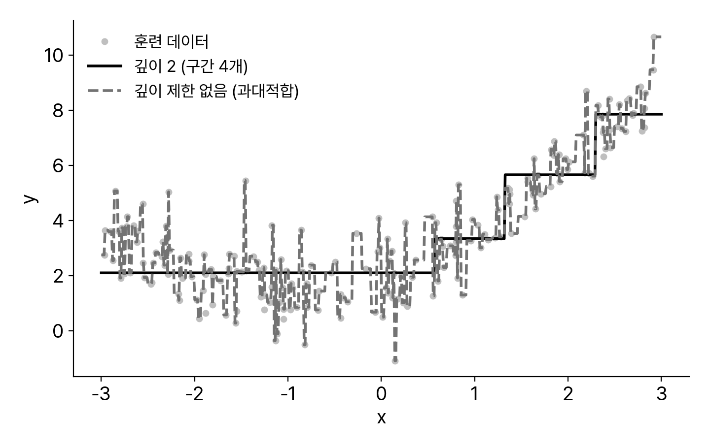
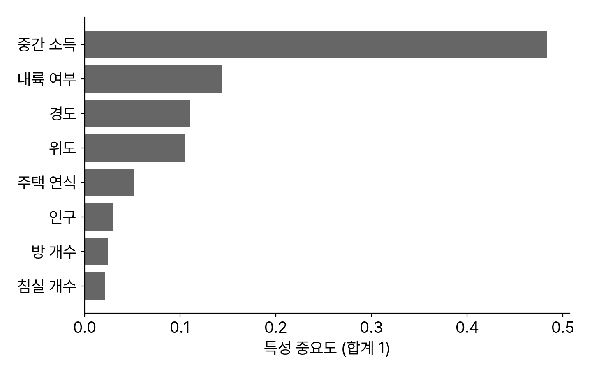
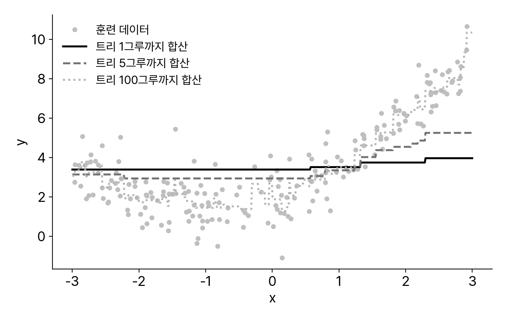

<!-- 덱 설계
교재: 『핸즈온 머신러닝 3판』 Ch6·7
코드: 06_decision_trees.ipynb, 07_ensemble_learning_and_random_forests.ipynb
원칙: 교재의 그림과 공식 노트북을 중심으로 진행한다. 슬라이드에는 비교와 판단에 필요한 내용만 남긴다.
-->

# 결정 트리

## 오늘 볼 내용

- 결정 트리는 어떻게 예측하는가
- 여러 트리를 결합하면 왜 좋아지는가
- 배깅과 부스팅은 무엇이 다른가

> Ch6과 Ch7을 펴고 공식 노트북 두 개를 차례로 실행합니다.

## 질문을 따라 내려간다

- 각 노드에서 하나의 조건을 확인
- 마지막 잎에서 클래스 또는 값을 예측
- 특성 스케일링이 필요하지 않음

> Ch6 노트북의 붓꽃 트리를 왼쪽부터 읽습니다. 한 샘플을 정해 어느 잎에 도착하는지 학생들과 따라갑니다.

## 분류 트리는 덜 섞이도록 나눈다

- 후보 특성과 기준값을 비교
- 자식 노드의 불순도가 가장 낮은 분할 선택
- 깊이 또는 샘플 수 조건까지 반복

> 지니 불순도는 한 클래스만 있으면 0입니다. 그림의 한 노드만 직접 계산하고 전체 수식 유도는 생략합니다.

## 회귀 트리는 구간의 평균을 예측한다

> 깊이 2인 트리와 제한 없는 트리를 비교합니다. 3주차 예제에서 결정 트리의 훈련 RMSE가 0이었던 이유를 이 그림에서 확인합니다.

## 트리의 크기를 제한한다

- `max_depth`, `max_leaf_nodes`
- `min_samples_leaf`
- 제한이 약하면 과대적합하기 쉬움

> Ch6 노트북에서 제한 없는 트리와 `min_samples_leaf`를 지정한 트리의 결정 경계를 비교합니다.

# 배깅과 랜덤 포레스트

## 서로 다른 모델의 예측을 모은다

- 분류: 투표 또는 확률 평균
- 회귀: 예측값 평균
- 같은 실수만 반복하면 효과가 작음

> Ch7 노트북의 투표 분류기에서 개별 모델과 투표 결과를 비교합니다.

## 데이터를 다르게 뽑아 여러 트리를 만든다

- 복원 추출로 여러 훈련 세트 생성
- 각 데이터로 트리를 따로 학습
- 모든 트리의 예측을 모아 최종 예측

> 이것이 배깅입니다. 각 트리가 보지 못한 OOB 샘플로도 성능을 추정할 수 있음을 공식 노트북에서 확인합니다.

## 랜덤 포레스트

- 데이터 샘플을 무작위로 선택
- 분할에 사용할 특성도 무작위로 선택
- 개별 트리의 차이를 키워 평균의 효과를 높임

> 3주차 주택 가격 예제에서 랜덤 포레스트가 선형 회귀와 결정 트리보다 좋았던 이유를 다시 연결합니다.

## 특성 중요도는 이렇게 읽는다

- 모델이 예측에 많이 사용한 특성
- 탐색과 설명에 활용
- 중요도가 높다고 원인인 것은 아님

> Ch7 노트북의 `feature_importances_`를 확인합니다. 서로 비슷한 특성은 중요도를 나눠 가질 수 있다는 점도 함께 설명합니다.

# 부스팅

## 앞 모델의 오차를 다음 모델이 보완한다

| 배깅 | 부스팅 |
|---|---|
| 모델을 따로 학습 | 모델을 순서대로 학습 |
| 예측을 평균 | 앞 모델의 오차를 보완 |

> AdaBoost는 틀린 샘플의 가중치를 높이고, 그레이디언트 부스팅은 남은 오차를 다음 모델이 학습합니다.

## 트리를 하나씩 더한다

> Ch7 노트북에서 트리 수가 늘어날 때 예측 곡선이 어떻게 달라지는지 봅니다. 트리가 많다고 항상 좋은 것은 아닌지 질문합니다.

## 함께 조정할 값

- `n_estimators`: 트리 수
- `learning_rate`: 각 트리의 반영 정도
- `max_depth`: 개별 트리의 복잡도
- 검증 성능이 나빠지면 조기 종료

> 공식 노트북의 staged prediction과 조기 종료 예제를 실행합니다. 학습률을 낮추면 보통 더 많은 트리가 필요합니다.

## XGBoost

- 그레이디언트 부스팅의 효율적인 구현
- 사이킷런과 비슷한 `fit`·`predict` 사용
- 제주 통행속도와 버스 ETA의 기준 모델

> Ch7의 XGBoost 예제까지만 실행합니다. 세부 튜닝은 수요일 실습에서 다룹니다.

# 교통 데이터에 적용

## 제주 통행속도 예측

- 목표: 도로 구간의 평균 속도
- 평가: MAE
- 분할: 2022년 8월 이전 / 2022년 8월
- 실습: 축소 데이터로 시작

> 오늘 배운 랜덤 포레스트와 XGBoost를 적용합니다. 데이터 소개와 첫 실행은 수요일 실습에서 진행하고, HW1도 같은 데이터로 시작합니다.

# 정리

## 오늘 확인할 질문

- 트리의 깊이를 제한하는 이유는 무엇인가?
- 랜덤 포레스트는 트리 하나와 무엇이 다른가?
- 배깅과 부스팅은 학습 순서가 어떻게 다른가?

> 다음 주부터 『밑바닥부터 시작하는 딥러닝 1』을 사용합니다. 선형 모델에서 배운 손실과 경사하강법이 신경망 학습에도 이어집니다.
